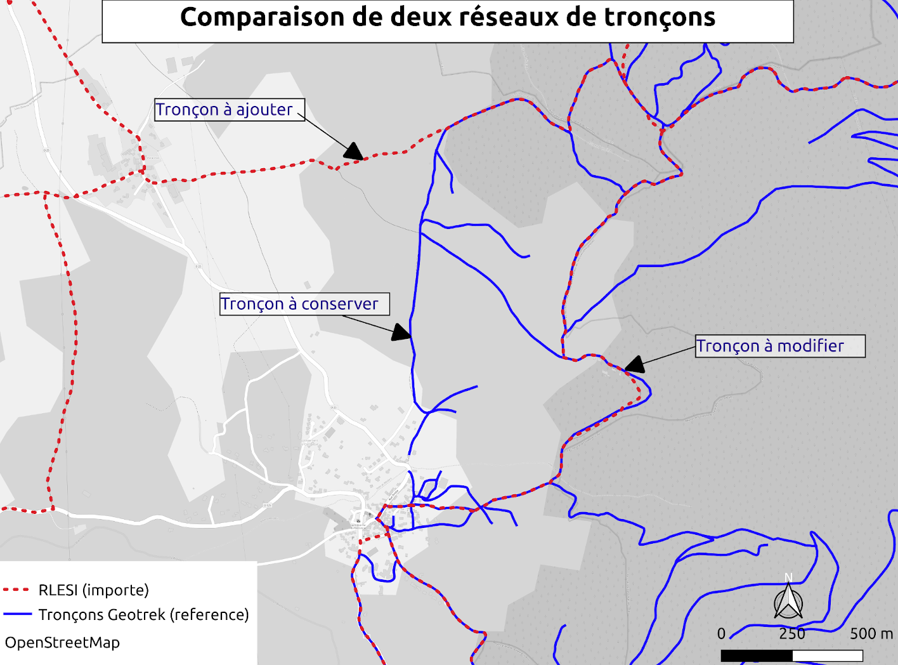

# Intégrer un réseau dans une base de données Geotrek existante

La gestion des réseaux de tronçons et leur mise à jour est un problème récurrent dans Geotrek, la segmentation dynamique compliquant les opérations d'insertion, suppression ou modification de géométries. Au Parc national des Cévennes, nous étions confrontés au problème suivant : nous avions un réseau de tronçons existant dans notre base Geotrek, et suite à la mise en place d'un RLESI (Réseau Local d’Espaces Sites et Itinéraires) sur une partie de notre territoire nous souhaitions substituer le réseau existant par celui défini par le RLESI.

Au sein de la zone que couvrait le RLESI, nous avions des tronçons non présents dans ce dernier que nous souhaitions conserver. Il ne s'agissait donc pas d'un remplacement pur et simple de tout l'existant dans cette zone, il fallait distinguer les tronçons à remplacer par ceux du RLESI et ceux à conserver.

Du fait de la segmentation dynamique dans Geotrek, il ne nous était pas possible de supprimer les tronçons présents dans les deux réseaux une fois identifiés pour les remplacer par le nouveau référentiel. Nous devions modifier la géométrie de ces tronçons de façon à mettre à jour notre réseau avec un minimum de conséquences sur les données déjà présentes dans la base.

Le schéma ci-dessous illustre les cas que nous avons dû traiter :

     

Ce travail a été mené par Idrissa DJEPA CREUTZ ([@IdrissaD](https://github.com/IdrissaD)) durant son stage puis un contrat au Parc national des Cévennes. Nous présentons ici les différentes étapes qui nous ont permis de réaliser la modification de notre réseau de tronçons dans notre base Geotrek.

Cette documentation se découpe en trois parties :
 - [Préparation des données à intégrer](0_preparation_donnees.md)
 - [Analyse des réseaux en vue de leur fusion](1_agregation_reseaux.md)
 - [Import des données une fois traitées dans une base Geotrek](2_import_donnees_geotrek.md)

---
**Outils nécessaires**

  * QGIS : visualisation et correction des données
  * Accès lecture/écriture à la base de données Geotrek
  * Possibilité de créer une nouvelle base PostgreSQL/PostGIS

---
