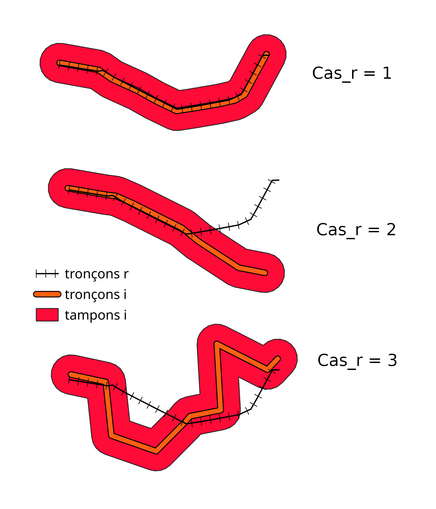
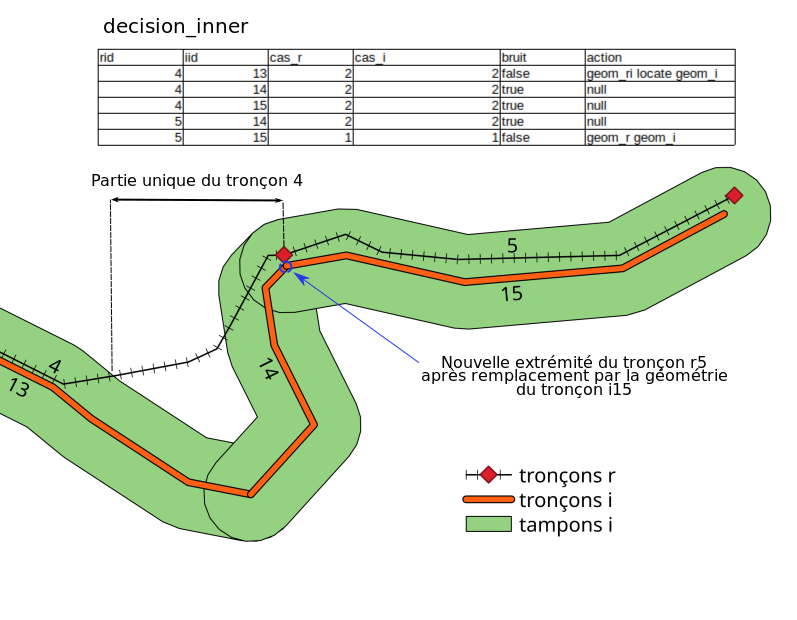

# Agrégation des deux réseaux

Sommaire:
- [Agrégation des deux réseaux](#agrégation-des-deux-réseaux)
  - [Principes](#principes)
  - [Préparation et présentation des scripts](#préparation-et-présentation-des-scripts)
    - [Scripts SQL](#scripts-sql)
  - [Définition des relations entre tronçons référence et importés](#définition-des-relations-entre-tronçons-référence-et-importés)
    - [Supervision manuelle des relations `bruit = NULL`](#supervision-manuelle-des-relations-bruit--null)
  - [Modification des géométries](#modification-des-géométries)
    - [Matrice de décision](#matrice-de-décision)
    - [Géométries uniques](#géométries-uniques)
    - [Création des nouvelles géométries du réseau référence](#création-des-nouvelles-géométries-du-réseau-référence)
    - [Intégration des géométries uniques `r` et `i`](#intégration-des-géométries-uniques-r-et-i)
      - [Géométries partiellement uniques](#géométries-partiellement-uniques)
      - [Géométries 100% uniques](#géométries-100-uniques)
    - [Jointure des informations attributaires](#jointure-des-informations-attributaires)
  - [Ajustements et supervision finale](#ajustements-et-supervision-finale)
    - [Supervision des erreurs finales](#supervision-des-erreurs-finales)
      - [Préparation](#préparation)
      - [Correction sur QGIS](#correction-sur-qgis)


## Principes
On entend par agrégation de réseaux l'import d'un réseau de tronçons dans un Geotrek qui contient déjà un réseau sur la même emprise géographique.

La difficulté de cette opération réside dans le fait que de nombreuses voies réelles (rues, chemins, pistes...) peuvent déjà être représentées dans les deux réseaux, mais par des géométries différentes. Ceci parce que les intersections ne se font pas aux mêmes endroits (un réseau moins dense aura moins d'intersections et des tronçons plus longs), ou bien car les tracés sont issus de relevés GNSS ou de sources différentes (IGN, OSM...), etc.

Il est donc important de faire la différence entre notre réseau de référence, c'est-à-dire celui qui est déjà dans notre base de données Geotrek, et le réseau que l'on souhaite importer dans notre base de données.

L'enjeu est donc de fusionner ces deux réseaux afin d'avoir la représentation sous forme de tronçons de :
- toutes les voies représentées uniquement dans le réseau de référence ;
- toutes les voies représentées uniquement dans le réseau à importer ;
- toutes les voies représentées dans les deux réseaux, avec la géométrie du réseau importé.

Si les deux premiers cas sont relativement faciles à gérer, c'est le troisième qui est le plus complexe.

Nous avons distingué 5 types de cas qu'il convient de traiter différement :

|code|description des cas       |explication                                                                                       |
|----|--------------------------|--------------------------------------------------------------------------------------------------|
| 1  |100% doublon              |Le tronçon est en doublon avec un tronçon de l'autre réseau sur 100% de sa longueur               |
| 2  |Doublon partiel continu   |Le tronçon est en doublon avec un tronçon de l'autre réseau sur une partie continue de sa longueur|
| 3  |Doublon partiel discontinu|Le tronçon est en doublon avec un tronçon de l'autre réseau sur plusieurs parties de sa longueur  |
| 4  |Unique partiel            |Une partie du tronçon est unique et non représentée dans l'autre réseau                           |
| 5  |100% unique               |L'entièreté de la longueur du tronçon est unique et non représentée dans l'autre réseau           |

Par ailleurs l'agrégation doit idéalement respecter les principes suivants :
- limiter la création de nouveaux tronçons pour une voie représentée dans le réseau référence de façon à ce que le moins de liens de segmentation dynamique soient cassés ;
- ne pas séparer deux tronçons qui étaient connectés dans le réseau référenceconserver au maximum la continuité entre les tronçons connectés dans notre réseau référence ;
- connecter toutes les extrémités de tronçons qui doivent l'être, quels que soient les changements de géométrie effectués ;
- enfin, conserver une trace de la source de la nouvelle géométrie via les champs `eid` et `comments`, ainsi que la table `core_path_networks` (par exemple avec un réseau nommé "RLESI ComCom XXX").

Les scripts SQL effectuent de nombreuses opérations automatiques pour s'approcher de cet idéal, mais ne dispensent pas des étapes de correction manuelle. Le résultat de ces scripts est la création d'une table finale `core_path_wip_new` constituée :
- de tous les tronçons du réseau référence, avec leur géométrie mise à jour (`geom_new`) ;
- des tronçons uniques (c'est-à-dire non présents dans le réseau référence) du réseau importé.

Deux étapes manuelles sont nécessaires à la réalisation du processus :
- la première se fait au milieu de celui-ci, avant la mise en place de la matrice de décision, en définissant certaines relations référence/importé comme étant du bruit ou des relations signifiantes. L'algorithme le fait pour la majorité des relations référence/importé, mais dans certains cas ambigus il faut l'aider. ;
- la deuxième se fait après l'exécution de l'ensemble des scripts, et consiste à corriger toutes les erreurs détectées sur le réseau obtenu.


## Préparation et présentation des scripts

Pour réaliser les opérations décrites ci-après, lancer les scripts et utiliser les projets QGIS sans réaliser d'adaptation, nous vous conseillons de créer une base de données nommée `geotrek_process` avec un utilisateur `geotrek_process` :


``` sql
CREATE ROLE geotrek_process PASSWORD 'geotrek_process' LOGIN;
CREATE DATABASE geotrek_process WITH OWNER geotrek_process;
```

``` sql
CREATE EXTENSION postgis;
```

Vous devez ensuite y créer deux tables contenant les données des réseaux :
  * `importe` : réseau à importer
  * `reference` : réseau de référence contenu dans la base geotrek

La couche du réseau à importer doit respecter la structure suivante :

| nom colonne | type                 | description                                                              |
| ----------  | -------------------- | -------------------------- 	                                            |
| id          | int                  | identifiant unique                                                       |
| geom        | geometry(LineString) | geométrie                                                                |
| structure_id| int                  | identifiant geotrek de la structure liée aux données                     |
| eid         | varchar              | identifiant de la donnée dans la couche d'origine                        |
| layer       | varchar              | nom de la couche d'origine (utile en cas de multiples fichiers d'origine)|

La couche du réseau de référence doit avoir la structure de la table `core_path` de geotrek. Pour cela vous pouvez importer manuellement les données ou utiliser des [Foreign Data Wrappers](https://wiki.postgresql.org/wiki/Foreign_data_wrappers).

### Scripts SQL

Quatre scripts SQL sont proposés dans le répertoire `scripts_sql/agregation_reseaux/`. Ils permettent de réaliser les opérations qui sont généralisables. 
Certaines requêtes sont présentes uniquement dans la documentation ici présente, et ne sont pas incluses dans les scripts. Elles permettente d'analyser les résultats de certaines étapes de l'agrégation, et sont à lancer manuellement.

En premier lieu il faut exécuter le script [0_lineaire_agg_preparation.sql](scripts_sql/agregation_reseaux/0_lineaire_agg_preparation.sql) qui permet de créer la table des types de cas `cas`, ainsi que des index spatiaux pour les tables `importe` et `reference`.

Le script [1_lineaire_agg_def_relations.sql](scripts_sql/agregation_reseaux/1_lineaire_agg_def_relations.sql) permet d'établir les relations entre les tronçons présents dans les deux réseaux (unique, doublons, ...).
Il crée les tables suivantes :
 - `tampon_importe` : table contenant les tampons du réseau de la table `importe`
 - `tampon_reference` : table contenant les tampons du réseau de la table `reference`
 - `tampon_splits_r` : table contenant toutes les géométries issues du découpage des géometries de `reference` contre les tampons de `importe`
 - `tampon_inner_r` : table contenant toutes les géométries communes entre `reference` et `importe` quand elles sont incluses dans les tampons, avec mention du cas (doublons partiels, ...)
- `tampon_splits_i` : table contenant toutes les géométries issues du découpage des géometries de `importe` contre les tampons de `reference`
 - `tampon_inner_i` : table contenant toutes les géométries communes entre `importe` et  `reference` quand elles sont incluses dans les tampons, avec mention du cas (doublons partiels, ...)
- `tampon_inner_all` : table de jointure des données contenues dans `tampon_inner_i` et `tampon_inner_r`. C'est dans celle-ci que le script détermine si une relation semble être du bruit ou non.


Le script [2_lineaire_agg_modifs_geoms.sql](scripts_sql/agregation_reseaux/2_lineaire_agg_modifs_geoms.sql) permet de calculer le nouveau réseau issu de la fusion des réseaux importé et de référence.

Il crée les tables suivantes :
 - `decision_inner` : table contenant la matrice de décision des données de `tampon_inner_all` n'étant pas considérées comme du bruit.
 - `tampon_outer_r` : table contenant la liste des tronçons `r` qui sont totalement en-dehors des tampons `i` et les portions uniques de tronçons `r` dont une partie est en doublon avec un ou plusieurs `i`.
 - `decision_outer_r` : table contenant la matrice de décision des `outer_r` sur le même modèle que `decision_inner`
 - `r_parties_uniques` : table contenant les parties unique de `reference`
 - `r_extremites` : table contenant une matrice d'extrémités. Le but est d'identifier les extrémités de tronçons `r` qui ont changé de coordonnées afin de pouvoir rattacher les parties uniques d'autres tronçons `r` qui partageaient une extrémité identique. En effet une partie unique de `r` n'étant par définition pas calquée sur une géométrie `i`, si le tronçon `r` auquel elles étaient connectées a changé de géométrie, il faut adapter les extrémités de cette partie unique
 - `core_path_wip_new` : table finale contenant le futur nouveau réseau : les doublons, les parties uniques de `reference` et les parties uniques de `importe`.


Le script [3_lineaire_agg_correction_erreurs.sql](scripts_sql/agregation_reseaux/3_lineaire_agg_correction_erreurs.sql) permet de mettre en évidence de potentielles erreurs à superviser manuellement.

Il crée la table suivante :
 - `erreurs_compte` : table qui calcule le nombre d'erreurs en fonction de leur type, et permet un suivi de l'évolution des erreurs si on lance plusieurs fois l'agrégation avec des paramètres ou des données différentes

Il crée également des *triggers* permettant de recalculer automatiquement les erreurs lors de modifications réalisées sur la table `core_path_wip_new`.

## Définition des relations entre tronçons référence et importés

**Script SQL associé** :
 *   [1_lineaire_agg_def_relations.sql](scripts_sql/agregation_reseaux/1_lineaire_agg_def_relations.sql)

Le principe de base sur lequel se fonde la reconnaissance des tronçons en doublon entre réseaux de référence et importé est la comparaison de zones tampons (*buffers*) créées autour de chacun des tronçons des deux réseaux. Les cas extrêmes sont plutôt simples à identifier :
- si un tronçon référence `r` et un tronçon importé `i` sont mutuellement compris dans le tampon de l'autre, alors ces deux tronçons représentent la même voie de circulation (route, chemin...) et il y a une relation de doublon total ;
- si un tronçon référence `r` et un tronçon importé `i` n'ont aucune partie de leur géométrie comprise dans le tampon de l'autre, alors ils ne représentent pas la même voie, mais surtout : si un tronçon `r` ou `i` n'intersecte (`ST_Intersects`) aucun tampon de l'autre réseau, alors c'est que la voie n'est représentée qu'au sein du réseau auquel il appartient, c'est un tronçon 100% unique.

Bien que simples, ces situations renferment déjà une part de subjectivité, dûe notamment à la taille du tampon, des tronçons et à la confiance que l'on a dans les données. Plus les tronçons seront petits, issus de données pour lesquelles la marge d'erreur est grande (3 à 5m pour des relevés GNSS basiques), les réseaux denses (milieux urbains) et le tampon large, moins les relations de doublon total seront pertinentes (risque augmenté de faux positifs).

Toutes les situations entre ces deux extrêmes sont donc encore plus sujettes à appréciation personnelle : est-ce qu'une relation de doublon à 95% est finalement équivalente à une relation de doublon total ? D'ailleurs 95% de la longueur ou du nombre de points de la géométrie ? De `i` par rapport à `r` ou l'inverse ? Etc.

Pour déterminer toutes ces situations, voici le procédé utilisé :
- découpage (ST_Split) des `r` contre les tampons `i` ;
- obtention des géométries `r` découpées intérieures aux tampons `i` (on ne veut conserver pour chaque `r` que ses parties comprises dans un tampon `i`) ;
- attribution de cas aux relations `ri`.

Une relation `ri` est le nom de la relation entre un tronçon `r` et un tampon `i` donnés. Un `r` peut donc être présent dans plusieurs relations `ri`...et pareil pour les tampons `i`. Ces relations sont réparties en trois cas :
- `cas_r = 1` quand l'ensemble d'un `r` est compris dans un tampon `i` ;
- `cas_r = 2` quand seule une partie d'un `r` est compris dans un tampon `i`, et que cette partie est continue, c'est-à-dire que sa géométrie est une LineString ;
- `cas_r = 3` quand seule une partie d'un `r` est compris dans un tampon `i`, et que cette partie est discontinue, c'est-à-dire que sa géométrie est une MultiLineString (le tampon `i` a découpé le `r` plusieurs fois).

Voici une visualisation de ces trois cas :

<p align="center">
     
</p>

Le même procédé est appliqué aux tronçons `i` par rapport aux tampons `r`, ce qui donne des relations `ir` et des `cas_i`.

### Calcul d'indicateurs et classement automatique en `bruit = True` ou `bruit = False`

La prochaine étape consiste en la création d'une table `tampon_inner_all` rassemblant toutes les relations entre tronçons `r` et tronçons `i`. Pour cela, on effectue d'abord une jointure entre la table des `r` par rapport aux tampons `i` (`tampon_inner_r`) et la table des `i` par rapport aux tampons `r` (`tampon_inner_i`). Un ensemble d'indicateurs, comme la longueur des relations `ri` et `ir`, ou l'aire d'un polygone dont les deux plus longs côtés sont `ri` et `ir`, sont calculés.
La table `tampon_inner_all` rassemble donc un ensemble d'informations permettant d'évaluer si une relation est signifiante ou non :


| rid 	| iid 	| cas_r 	| cas_i 	| longueur_ri 	| longueur_r 	| longueur_ir 	| longueur_i 	| bruit 	| aire_ir_ri 	|
|:---:	|:---:	|:-----:	|:-----:	|:-----------:	|:----------:	|:-----------:	|:----------:	|:-----:	|:----------:	|
|  1  	|  54 	|   1   	|   2   	|     25.6    	|    25.6    	|     28.3    	|     45     	|  null 	|    area (non calculée ici)    	|
|  1  	|  23 	|   2   	|   2   	|      5      	|    25.6    	|     5.7     	|    561.5   	|  null 	|    area (non calculée ici)    	|
|  2  	|  23 	|   2   	|   1   	|     570     	|    803.2   	|    561.5    	|    561.5   	|  null 	|    area (non calculée ici)    	|

Les géométries `geom_r`, `geom_i`, `geom_ir`, `geom_ri` et `geom_ir_ri` sont également présentes dans cette table.

La définition d'une relation comme étant du `bruit` ou pas dépend donc de ces indicateurs. De nombreuses requêtes du script correspondent à cette étape, dont voici les plus importantes :

- si `r` ou `i` est entièrement compris dans le tampon de l'autre, alors la relation n'est pas du bruit (`bruit = FALSE`) ;
- si un `r` est entièrement compris dans plusieurs tampons `i` (plusieurs lignes avec le même `rid` et `cas_r = 1`), alors seule la relation dont `aire_ir_ri` est la plus faible (autrement dit, la `geom_ir` la plus proche de `r`) est signifiante (`bruit = TRUE` pour toutes les autres) ;
- si `r` et `i` sont des doublons partiels (`cas_r IN (2,3) AND cas_i IN (2,3)`) et que les longueurs de `ri` ou `ir` ne répondent pas à des critères, subjectifs, de signifiance, alors la relation est du bruit. Actuellement, si `longueur_ri` ou `longueur_ir` font moins de 10.5m (un peu plus de deux fois la taille du tampon), ou si le rapport entre les longueurs de `ir` et `i` et celles de `ri` et `r` sont égaux à moins de 10%, la relation est considérée comme du bruit.
- etc.

### Supervision manuelle des relations `bruit = NULL`

Une fois le script [1_lineaire_agg_def_relations.sql](scripts_sql/agregation_reseaux/1_lineaire_agg_def_relations.sql) exécuté et la table `tampon_inner_all` créée, une supervision manuelle est nécessaire.

En effet, certaines situations sont trop floues pour que le script les classe comme bruit ou relation signifiante, et toutes les relations pour lesquelles le champ `bruit` est toujours nul après l'exécution de ce deuxième script doivent être supervisées manuellement via un SIG comme QGIS.

Le but est qu'un·e humain·e détermine visuellement, par comparaison des tronçons concernés et leur contexte géographique, si la relation de doublon est signifiante ou non. Pour cela, il suffit d'attribuer une symbologie spécifique à la table `tampon_inner_all` pour les entités pour lesquelles `bruit = NULL`, table présente sous forme d'une couche QGIS pour `geom_r` et d'une autre pour `geom_i`. Pour chaque relation supervisée, il suffit alors d'attribuer au champ `bruit` la valeur `false` si elle est signifiante, ou `true` si on souhaite l'exclure de la suite des traitements.

L'attribution de la valeur `true` à `bruit` signifie que c'est une fausse relation de doublon et que les deux tronçons représentent deux voies différentes sur le terrain. Lors de l'intégration des données dans Geotrek, les deux tronçons seront donc importés.

Une fois cette étape réalisée, la suite du script [2_lineaire_agg_modifs_geoms.sql](scripts_sql/agregation_reseaux/2_lineaire_agg_modifs_geoms.sql) peut être lancée. Par défaut, toutes les relations dont le champ `bruit` est nul sont considérées comme signifiantes.

Le projet QGIS `correction_manuelle_bruits.qgz` vous permet de visualiser les données à superviser.

## Modification des géométries

**Script SQL associé** :
 *   [2_lineaire_agg_modifs_geoms.sql](scripts_sql/agregation_reseaux/2_lineaire_agg_modifs_geoms.sql)


### Matrice de décision

La table `decision_inner` est créée, rassemblant toutes les relations de `tampon_inner_all` pour lesquelles `bruit = False`.

### Géométries uniques

Cette table `decision_inner` permet alors d'obtenir par soustraction toutes les géométries uniques des `r`, c'est-à-dire en doublon avec aucun `i`, soit :
- tous les `r` dont l'identifiant n'est pas présent dans `decision_inner`, qui sont 100% uniques ;
- tous les `r` présents dans `decision_inner` mais dont l'union des géométries en doublon avec des `i` n'est pas égale au `r` original, qui sont partiellement uniques.

Une matrice de décision `decision_outer_r` de ces géométries extérieures (aux tampons) est alors créée.

### Création des nouvelles géométries du réseau référence

À partir de cette table, le script peut déterminer quelles opérations spatiales effectuer afin d'obtenir la nouvelle géométrie des tronçons du réseau référence. À partir de maintenant, les opérations spatiales modifient les géométries du réseau référence en l'adaptant un maximum au réseau importé, qui constitue in fine la nouvelle référence.

Une table `core_path_wip_new` est créée. Cette table comprend également les champs attributaires de `core_path` qui sont à modifier avec la géométrie (en l'occurrence `comments`, `eid` et `structure_id`), ainsi que des champs utiles pour la supervision manuelle (`erreur`, `supervised`). Le champ `geom_new` contient la nouvelle géométrie de chaque tronçon.

Trois types d'actions sont définis selon les valeurs de `decision_inner.cas_r` et `decision_inner.cas_i` :
- si `cas_r` et `cas_i` sont égaux à 1, alors la nouvelle géométrie de `r` sera celle du `i` correspondant. C'est le cas où chacun des deux tronçons est inclus dans le tampon de l'autre ;
- si seul `cas_r` est égal à 1, alors la nouvelle géométrie de `r` sera la projection de `r` sur `i` (en utilisant `ST_LineSubstring` et `ST_LineLocate` des extrémités de `r`). C'est le cas où la géométrie de `r` est totalement incluse dans le tampon `i` et celle de `i` n'est pas incluse totalement dans le tampon de `r` ;
- si ni `cas_r` ni `cas_i` ne sont égaux à 1, alors la nouvelle géométrie de `r` sera la projection de `ri` sur `i`. C'est le cas où les géométries de `r` et `i` ne sont pas totalement incluses dans le tampon de l'autre.

Afin d'éviter de découper trop près d'une extrémité, si les points obtenus par projection sur `i` sont à moins de 5m du début ou de la fin de `i`, c'est l'extrémité concernée qui sera prise en compte pour la nouvelle géométrie.

### Intégration des géométries uniques `r` et `i`

Il y a deux cas de géométries uniques :
- les géométries partiellement uniques, c'est-à-dire représentant des voies présentes dans `r` et dans `i` mais qui n'ont pas la même "longueur" (ne s'arrétent pas au même endroit) ;
- les géométries 100% uniques, c'est-à-dire représentant des voies présentes dans `r` et absentes de `i`.

#### Géométries partiellement uniques
Une table `r_parties_uniques` stocke toutes les parties uniques (en doublon avec aucun `i`) des tronçons `r`, par sélection depuis `decision_outer_r`. La colonne `geom_new` des enregistrements correspondants dans la table `core_path_wip_new` est mise à jour en y ajoutant la géométrie de la partie considérée comme unique.

Cette mise à jour a pour conséquence de faire cohabiter des tronçons issus des deux réseaux (référence et importé). Or, cette cohabitation peut provoquer des incohérences. Le cas typique est lorsque deux tronçons `r` se touchaient (c'est-à-dire partageaient une extrémité), que la géométrie de l'un a été calquée sur un tronçon `i` alors que la géométrie de l'autre est restée intacte, l'extrémité commune peut ainsi être déconnectée.

On voit dans l'exemple suivant une situation où ce problème se pose : une déconnexion des tronçons r4 et r5 suite à la mise à jour de r5 par i5.

<p align="center">
     
</p>


Afin de corriger ce phénomène, le script crée une matrice des extrémités `r_extremites`, permettant d'identifier les extrémités des parties uniques correspondant aux extrémités d'autres tronçons `r` qui ont été déplacées. La géométrie des parties uniques concernées est ensuite mise à jour par l'ajout de la nouvelle extrémité à la fin ou au début de la `geom_new` du tronçon concerné.

Une fois l'ensemble des géométries `r` traitées (parties en doublon et parties uniques), une comparaison entre le réseau tel qu'il est à cette étape et le réseau importé permet d'identifier tous les tronçons `i` 100% uniques et les parties uniques de tronçons `i` qu'il reste à intégrer. Un `ST_Difference` sur le `ST_Union` de l'ensemble des `geom_new` donne un ensemble de tronçons à insérer dans `core_path_wip_new`.


#### Géométries 100% uniques

Les tronçons `r` 100% uniques, déjà présents dans `core_path_wip_new`, doivent également subir une mise à jour de leurs extrémités afin de préserver la continuité du réseau.

### Jointure des informations attributaires

Pour conserver une trace de cette agrégation de réseaux, le script ajoute aux champs `eid`, `comments` et `structure_id` les valeurs issues du réseau importé. L'`eid` est remplacé par l'`id` du ou des tronçons `i` desquels le tronçon `r` a pris sa nouvelle géométrie, le nom de la couche et la date des données sont ajoutés à la valeur déjà existante de `comments` (concaténation), et le champ `structure_id` prend la valeur de l'id de la structure correspondante dans la table `authent_structure`.


## Ajustements et supervision finale

Un paramètre principal peut être ajusté selon les données : c'est la taille du tampon. Fixée à 5 mètres pour l'instant, elle peut être augmentée afin de réduire le nombre de tronçons finaux et potentiellement réduire le nombre d'erreurs, au détriment de la finesse de reconnaissance des doublons. Elle peut aussi être réduite afin d'éviter que des tronçons soient considérés comme des doublons par erreur : plus de tronçons seront ainsi considérés comme uniques et le nombre total de tronçons finaux sera plus élevé, l'analyse est plus fine mais demandera peut-être plus d'intervention manuelle.

Plus un réseau est dense, plus il faut augmenter la taille du tampon avec prudence, car cela risque d'amener autant d'erreurs et incohérences que d'en supprimer. Par exemple, le réseau de référence du Parc national des Cévennes étant la BD Topo de l'IGN, nous avons un niveau de maillage extrêmement élevé. Un tampon à 10m n'a pas permis de réduire le nombre d'erreurs détectables, et a sûrement augmenté le nombre de celles non détectables, c'est pourquoi nous sommes restés à 5m.
Pour l'instant le script n'est pas écrit de manière à pouvoir changer ce paramètre simplement, car au-delà de la taille du tampon lui-même, la valeur choisie est une base de calcul pour de nombreuses autres requêtes et principes de définition des relations entre tronçons.

**Script SQL associé** :
 *   [3_lineaire_agg_correction_erreurs.sql](scripts_sql/agregation_reseaux/3_lineaire_agg_correction_erreurs.sql)

### Supervision des erreurs finales

#### Préparation

Une fois le script exécuté dans sa totalité, le réseau obtenu, une fusion des deux réseaux initiaux, est contenu dans la table `core_path_wip_new`. De nombreuses erreurs topologiques sont à prévoir : les traitements automatiques ne peuvent les éviter toutes. Sur le jeu de données à partir duquel ce script a été créé, il y avait une moyenne de 15% d'erreurs (550 tronçons avec erreur sur 3800 relations de la table `decision_inner`). Le taux est calculé par rapport à cette table car les tronçons 100% uniques sont peu susceptibles de produire des erreurs.

Corriger manuellement des erreurs peut prendre de quelques secondes à plusieurs minutes selon le type d'erreur et le contexte spatial. Il faut donc compter plusieurs jours pour la correction de 500 à 600 erreurs.

Avant de passer sur QGIS, certaines étapes sont nécessaires pour faciliter la supervision. Le principe est de mettre à jour la table `core_path_wip_new` en ajoutant une mention de l'erreur potentielle dans la colonne `erreur`.

Il faut que toutes les données aient le même type de géométrie pour pouvoir les modifier ensemble dans QGIS. Ce type doit être de type linestring. De plus les géométries ponctuelles ou trop courtes poseront problème dans Geotrek ren raison de la contrainte `core_path_geom_isvalid` lors de la mise à jour des géométries de `core_path`.

Une table `erreurs_compte` stocke le nombre d'erreurs de chaque type à chaque exécution du script [3_lineaire_agg_correction_erreurs.sql](scripts_sql/agregation_reseaux/3_lineaire_agg_correction_erreurs.sql). Cela permet par exemple de suivre l'évolution du nombre et du type d'erreurs selon les ajustements apportés aux requeêtes d'agrégation des réseaux (taille du tampon, etc).

Les erreurs suivantes sont identifiées et viennent renseigner le champ `core_path_wip_new.erreur` :
- `ligne_trop_courte` : géométries ponctuelles et LineString de moins de 1m ;
- `st_crosses` : tronçons qui en croisent d'autres ;
- `st_overlaps_contains_within` : tronçons qui en chevauchent ou contiennent d'autres ;
- `st_isvalid` : tronçons ne validant pas la fonction PostGIS [`ST_IsValid()`](https://postgis.net/workshops/postgis-intro/validity.html) ;
- `st_issimple` : tronçons ne validant pas la fonction PostGIS [`ST_IsSimple()`](https://postgis.net/docs/ST_IsSimple.html) (auto-intersection...) ;
- `st_geometrytype` : tronçons dont la géométrie n'est pas de type LineString ;
- `extremite` : tronçons courts dont une extrémité n'est reliée à aucun autre tronçon.

Une fonction `trigger_geom_new()` est appelée par un trigger déclenché à chaque mise à jour du champ `core_path_wip_new.geom_new`. Elle met à jour le champ `erreur` à chaque sauvegarde de la couche dans QGIS. Cela permet de ne conserver la symbologie spécifique que pour les tronçons encore problématiques, et pas pour ceux corrigés.

#### Correction sur QGIS

Plusieurs couches sont nécessaires pour faciliter la supervision :
- `core_path_wip_new.geom_new` : symbologie catégorisée selon la valeur du champ `erreur`, et sous-catégorisée selon la valeur du champ `supervised` ;
- `reference.geom` et `importe.geom` : avec des symbologies différentes pour pouvoir comparer les tronçons problématiques avec les réseaux initiaux ;
- une couche d'imagerie satellite, une couche IGN (SCAN25, Plan V2...), une couche OpenStreetMap : permettent de comparer les réseaux initiaux avec plusieurs sources de données et aident à la décision.

L'activation de l'accrochage aux sommets et segments facilitera la modification des géométries.

Certaines erreurs n'ont pas à être corrigées manuellement. Par exemple deux tronçons qui se croisent en leur milieu répondront à l'erreur `st_crosses`, mais plutôt que de les scinder manuellement en quatre tronçons distincts, nous pouvons laisser les triggers de Geotrek s'en charger plus tard. Pour ces cas, il faut attribuer la valeur `true` au champ `supervised` afin d'appliquer une symbologie spécifique et de se souvenir qu'on les a déjà supervisés. La fonction `trigger_geom_new()` applique automatiquement cette valeur aux tronçons dont la géométrie a été modifiée, aussi il peut être plus rapide de "modifier" la géométrie de ces tronçons, en déplaçant un point puis en le remettant au même endroit avant de sauvegarder la couche, que de modifier manuellement la valeur du champ.

Il vaut mieux corriger les erreurs dans cet ordre :
- `ligne_trop_courte` : certains tronçons seront à supprimer (sélection d'entité puis suppression). Attention lorsque le champ erreur a cette valeur, elle n'est pas mise à jour par le trigger ;
- `st_isvalid` et `st_issimple` : peu d'erreurs à corriger ;
- `st_geometrytype` : certains tronçons seront à scinder en plusieurs entités ;
- `extremite` et `st_overlaps_contains_within` : erreurs assez similaires ;
- `st_crosses` : les plus nombreuses mais souvent les plus simples à corriger.

----
Attention

L'exécution du trigger lors de la sauvegarde de la couche `core_path_wip_new` se lance de façon unitaire et il est fréquent lors de la correction simultanée de plusieurs tronçons que de nouvelles erreurs soient détectées alors qu'elles ont bien été corrigées. Dans ce cas il faut simuler une nouvelle mise à jour de la géométrie (ex : déplacement d'un sommet et remise à sa place initiale) pour que tout rentre dans l'ordre.

------

L'algorithme crée de nombreux tronçons "uniques" issus du réseau importé, alors qu'un tronçon `r` aurait pu voir sa géométrie calquée dessus. La correction manuelle permet d'en supprimer un bon nombre et de recalquer les tronçons référence correspondants sur ceux-ci. Lorsque cela se produit, il ne faut pas oublier de mettre à jour les champs `eid`, `comments` et `structure_id` selon la même structure que celle créée par le script (remplacement total des valeurs de `eid` et `structure_id`, concaténation de la valeur originale et de la nouvelle valeur de `comments`).

Par exemple, cela arrive souvent là où des tronçons `r` ont été projetés sur les tronçons `i` à 6 ou 7 mètres d'une intersection. Cela n'a pas vraiment de sens que le `r` s'arrête à quelques mètres d'une intersection et soit ainsi séparé du `r` qu'il touchait à l'origine par un mini-tronçon `i` de quelques mètres. Dans ce genre de cas, il suffit de supprimer le tronçon `i` et de raccorder les deux `r` au niveau de l'intersection (tout en suivant le tracé du `i` supprimé bien sûr).

Une fois toutes les erreurs supervisées, on peut vérifier que tous les tronçons ont bien une `geom_new` : lors de certaines suppressions de tronçons, seule la géométrie est supprimée au lieu de l'entité entière.

Un exemple de projet QGIS permettant la correction des erreurs détectées est présent dans le dépôt : [correction_manuelle_finale.qgz](projet_qgis/correction_manuelle_finale.qgz).
