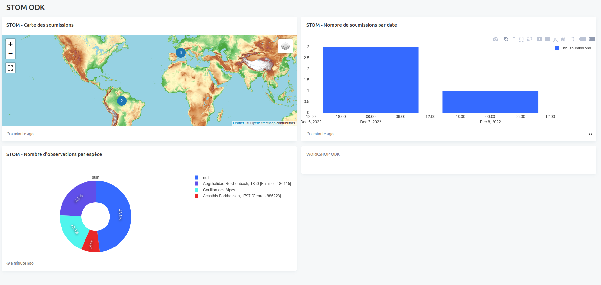
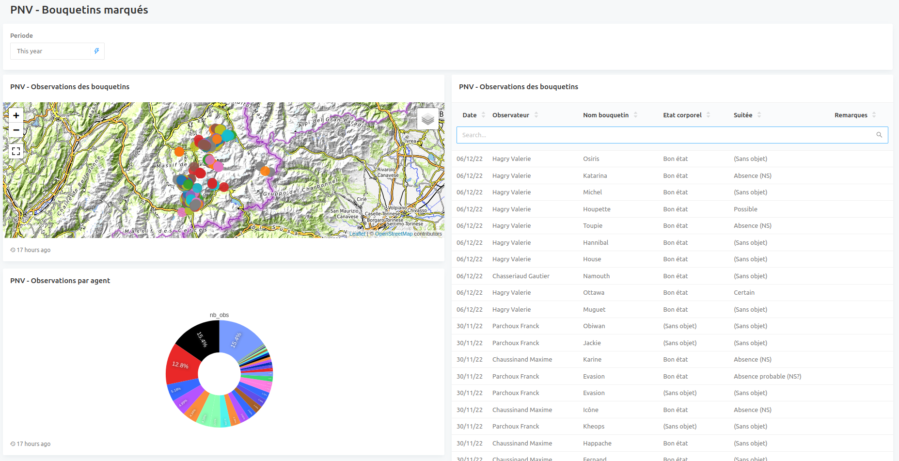

# CENTRAL2PG

## Central2PG est un ensemble de fonctions postgresql qui permet d'interroger l'API ODATA d'ODK depuis postgreSQL.
Développé par Mathieu Bossaert, toute la documentation est sur Github
[Central2PG](https://github.com/mathieubossaert/central2pg)

## Installation
Le serveur sur lequel se trouve la base de données PG doit avoir Curl installé 

 - Dans la BDD de destination, il suffit d'exécuter le [script Central2pg.sql](https://github.com/mathieubossaert/central2pg/blob/master/central2pg.sql) 
 - Ce script va créer un schema odk_central  et les fonctions qui seront ensuite appelées pour interagir avec ODK

## Utilisation
Une fonction permet avec une seule instruction de générer un schema qui récupérera les données d'un formulaire ODK. Il contiendra 2 tables pour les soumissions et ensuite 2 tables par coucle repeat (avec dans ces dernières un champs submission_id pour faire le lien)

    SELECT odk_central.odk_central_to_pg('userODK@mail.fr','passwordODK','odk-server.test.fr',id du projet,'nom du formulaire','schema de bdd',	'');

### Filtrer les réponses
S'il est en théorie possible de passer un filtre à la requête curl qui récupère les soumissions, ça ne fonctionne pas, impossible pour l'instant de passer dans curl les paramètres de filtrage sur le reviewstate
### Récupérer les médias

 - Utiliser la fonction get_file_from_central en passant l'id de la submission et le nom du fichier media
 - La récupération n'est pas automatisée dans central pour l'instant (dans la doc de central, elle est faite au cas par cas en s'appuyant sur une vue qui recense les photos déjà téléchargées)
 - Le media est lié à la soumission même s'il est saisi dans une table fille. L'URL de récupération est toujours sous la forme `https://odk-server.test.fr/v1/projects/id_project/forms/nom_formulaire/submissions/uuid%3Asubmission/attachments/nom_image.jpg`
 - Attention, il faut que l'utilisateur postgresql ait l'accès en écriture au dossier spécifié dans la fonction. Il faut également bien mettre le chemin absolu vers le dossier sur le serveur.
 

    select odk_central.get_file_from_central(userODK@mail.fr','passwordODK','odk-server.test.fr',id du projet,'nom du formulaire','uuid%%3Asoumission','nom_image_source.jpg','/chemin/absolu','nom_image_destination.jpg');
### Mettre un jour le ReviewState pour mettre un flag sur les soumissions
Cette fonction n'existe pas dans Central2PG aujourd'hui et pourra être utile si on arrive à filtrer les réponses

 - Utilise une requete curl PATCH, permet de mettre à jour le reviewState
 

    curl -X PATCH https://odk-server.test.fr/v1/projects/id_project/forms/nom_formulaire/submissions/uuid%3Asoumission
     -H 'Content-Type: application/json'
     -H 'Authorization: Bearer token
     -d '{"reviewState": "rejected"}'

    

 - Fonction à ajouter dans odk_central si besoin

    CREATE 
OR REPLACE FUNCTION update_submission_rejected(
  email text, password text, central_domain text, 
  project_id integer, form_id text, 
  sub_id text
) RETURNS void LANGUAGE 'plpgsql' COST 100 VOLATILE PARALLEL UNSAFE AS $BODY$ declare url text;
--declare content_type text;
declare requete text;
begin url = concat(
  'https://', central_domain, '/v1/projects/', 
  project_id, '/forms/', form_id, '/submissions/uuid%%', 
  sub_id
);
EXECUTE (
  'DROP TABLE IF EXISTS media_to_central;
                 CREATE TEMP TABLE media_to_central(form_data text);
                 SET search_path=odk_central,public;'
);
requete := format(
  'COPY media_to_central FROM PROGRAM $$ curl --include -X PATCH ' || url || '  -H ''Content-Type: application/json'' -H ''Authorization: Bearer ' || odk_central.get_token_from_central(email, password, central_domain)|| ' ''  -d ''{"reviewState": "rejected"}'' $$; '
);
execute requete;
END;
$BODY$;

### Mettre à jour un formulaire avec des médias (liste csv)
La mise à jour d'un formulaire se fait en deux étapes: envoi des fichiers (formulaires et listes de valeurs) puis publication d'une nouvelle version du formulaire
 - La fonction push_media_to_central permet d'envoyer sur Central des fichiers xml json ou csv 
 - La fonction publish_from_version permet de créer la nouvelle version du formulaire à partir es fichiers envoyés par la précédente

## Limites 
C'est une solution très simple à utiliser pour gérer dans postgresql des formulaires ODK, surtout dans le cas de formulaires simples qui n'ont pas vocation à entrer dans Geonature.
Voici les limites de l'utilisation  de Central2PG identifiées lors du workshop

 - Si on ne peut pas trier les soumissions téléchargées, cela oblige à retélécharger toutes les soumissions à chaque fois, voire à écraser le schema entier. Cela parait lourd, notamment s'il y a un grand nombre de données ou du post-traitement des données dans postrgesql
 - C'est l'utilisateur postgresql qui gère médias et formulaires sur le serveur ce qui n'est pas idéal 

# Redash
Dans le cas où le formulaire ODK n'est pas lié à Geonature, il est possible de très facilement visualiser les données sur une interface Redash. Cela permet d'afficher des tables/cartes de données (et de les télécharger), de créer des graphiques et tableaux de synthèse le tout avec des filtres qui peuvent être dynamiques.
## Installation
Sur un serveur où il n'y a que la bdd de central2pg, installer Redash en suivant cette [documentation](https://gitlab.in2p3.fr/sist/tuto-instal-redash#fn1-3089). Cette installation qui est décrite pour Ubuntu 18/20 a fonctionné sans problème sur un serveur Debian 10
Une fois que l'installation est terminée, la console de Redash est accessible à l'URL:5000
## Administration
Il est possible depuis l'administration de Redash de :

 - Gérer des utilisateurs: droits user ou admin
 - Déclarer des data sources: bdd, fichiers plats, google docs...
 - Créer des requêtes: on écrit directement le code SQL dans la fenêtre.
 - A noter: on peut ajouter des filtres (dates, périodes, listes déroulantes soit inscrites en dur soit qui proviennent de requêtes) en créant des {{Parameter}}. Ces filtres peuvent ensuite être utilisés au niveau du widget (le tableau/graph) ou du dashboard entier
 - Au niveau de la requête on peut ensuite créer une ou plusieurs interfaces visualisation (différents graphiques, cartes, tableaux)
 - Pour chaque requête on peut définir la période de rafraichissement des données ce qui permet de ne pas relancer les requêtes de type référentiel trop souvent
 - Créer des Dashboards qui correspondent à des pages. Sur une page, on peut ajouter des widgets, du texte ou des filtres généraux (si un paramètre est utilisé avec le même nom dans différents widgets il peut être utilisé globalement sur la page, se configure au niveau du widget)
 - On peut définir la périodicité de refraichissement du dashboard
 - On peut générer une URL publique de visualisation pour chaque Dashboard, qui sera accessible à tous sans login
        
        
 - La présentation Dashboard permet de télécharger les données en csv ou xls, les graphs et cartes en png

## Limites
Voici les limites de Redash identifiées lors de nos tests:

 -  Le widget Map n'accepte que des marqueurs Points, pas d'autres géométries
 - Quand on utilise un filtre venant d'une requête, il est chargé par défaut, on ne peut pas ne pas l'utiliser
 - Les performances semblent limitées (notamment dès qu'on dépasse une centaine de marqueurs pour l'affichage des cartes)
