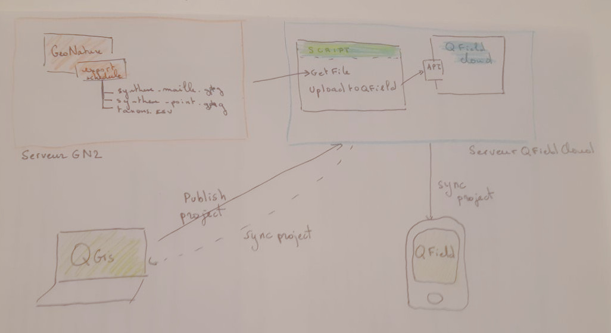

# Exemple de projet Qfield de consultation des données issues de la synthese geonature

 



# GeoNature

Configuration d'export synchronisé sous GeoNature

## Création des vues

3 vues sont a créées :
 * v_export_qfield_synthese_flore_point : export des données de synthese sous forme de point
 * v_export_qfield_synthese_flore_mailles : export des données de synthese sous forme de maille
 * v_export_qfield_taxref : export de la liste des taxons présent dans l'export maille

``` sql
-- export point
 CREATE OR REPLACE VIEW gn_exports.v_export_qfield_synthese_flore_point AS
 SELECT st_centroid(s.the_geom_local),
    regne, group1_inpn, group2_inpn, classe, ordre, famille, nom_valide, nom_vern,
    s.date_max AS date_debut, s.date_min AS date_fin,
    s.count_min AS nb_min, s.count_max AS nb_max,
    s.observers AS observateur,
    td.dataset_shortname AS jdd_nom, t.cd_ref, s.id_synthese
 FROM gn_synthese.synthese s
 JOIN taxonomie.taxref t
 ON t.cd_nom = s.cd_nom
 JOIN gn_meta.t_datasets td
 ON td.id_dataset = s.id_dataset
 WHERE t.regne IN ('Plantae', 'Fungi');

--export maille
CREATE OR REPLACE VIEW gn_exports.v_export_qfield_synthese_flore_mailles
AS WITH code_m AS (
         SELECT bib_areas_types.id_type
           FROM ref_geo.bib_areas_types
          WHERE bib_areas_types.type_code::text = 'M1'::text
        )
 SELECT la.area_code,
    la.geom,
    t.regne,
    t.group1_inpn,
    t.group2_inpn,
    t.classe,
    t.ordre,
    t.famille,
    t.nom_valide,
    t.cd_ref,
    min(s.date_min) AS min,
    max(s.date_min) AS max,
    count(DISTINCT s.id_synthese) AS count,
    row_number() over () as id
   FROM gn_synthese.cor_area_synthese cas
     JOIN ref_geo.l_areas la ON la.id_area = cas.id_area
     JOIN code_m ON la.id_type = code_m.id_type
     JOIN gn_synthese.synthese s ON s.id_synthese = cas.id_synthese
     JOIN taxonomie.taxref t ON t.cd_nom = s.cd_nom
 WHERE t.regne IN ('Plantae', 'Fungi')
  GROUP BY la.area_code, la.geom, t.regne, t.group1_inpn, t.group2_inpn, t.classe, t.ordre, t.famille, t.nom_valide, t.cd_ref;

-- export de la liste des taxons

CREATE OR REPLACE VIEW gn_exports.v_export_qfield_taxref
AS
SELECT DISTINCT  t.cd_ref, t.regne, t.group2_inpn, t.lb_nom, t.nom_vern
FROM taxonomie.taxref t
JOIN gn_exports.v_export_qfield_synthese_flore_mailles vm
ON vm.cd_ref = t.cd_nom;

```

## configuration des exports geonature

Création de 3 exports

|label|schema_name|view_name|geometry_field|view_pk_column|
|-----|-----------|---------|--------------|--------------|
|  qfield export synthese point flore             | gn_exports    | v_export_qfield_synthese_flore_point        | st_centroid            | id_synthese  |
|  qfield export synthese maille flore            | gn_exports    | v_export_qfield_synthese_flore_mailles      | geom                   | id |
|  qfield export taxon flore                      | gn_exports    | v_export_qfield_taxref                      |                        | cd_ref |


Création de trois planifications d'export

|                     label                      |  format  |
|------------------------------------------------|---------- |
| qfield export synthese point flore             | gpkg     |
| qfield export synthese maille flore            | gpkg     |

# Upload de fichiers sur un projet du Cloud en lignes de commande

## Sources
*https://pypi.org/project/qfieldcloud-sdk/ 
*https://opengisch.github.io/qfieldcloud-sdk-python/ 
*https://github.com/opengisch/qfieldcloud-sdk-python 

## Installation de QFieldCloud-sdk 
Se placer sur le serveur où est installé QFieldCloud.
```
cd <dossier_qfcloud>
sudo apt install python3 pipx 
pipx install qfieldcloud-sdk 
pipx ensurepath 
exit 
```
Exit permet de sortir de la session. Ré-ouvrir une session pour bénéficier des mises à jour des variables d'environnement. 

## Quelques exemples d'utilisation de QFieldCloud CLI
Lister les projets du cloud :
```
qfieldcloud-cli -u <user> -p <pwd>! -U <qfcloud_api_url> list-projects
```
qfcloud_api_url : url de QFielDCloud en https avec l'URI de l'API /api/v1

Uploader des fichiers sur le cloud :
```
qfieldcloud-cli -u <user> -p <pwd>! -U <qfcloud_api_url> upload-files --force <project_id> <path_to_files> --filter "<filter>"
```
project_id : il peut être récupéré soit depuis l'interface soit avec le commande `list_projects`.
path_to_files : le dossier où sont stockées les fichiers à uploader.
filter : filtre sur les noms de fichiers. Tout `*.*`, que les géopackages `*.gpkg`.... 

Lister les fichier d'un projet :
qfieldcloud-cli -u ${QFCLOUD_USR} -p ${QFCLOUD_PWD} -U ${QFCLOUD_URL} list-files ${QFCLOUD_PRJ_ID} 
