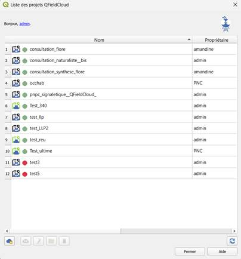
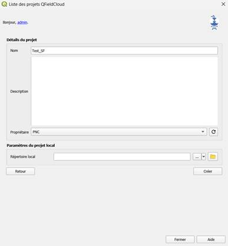
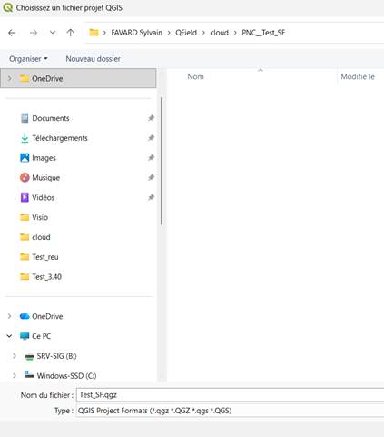
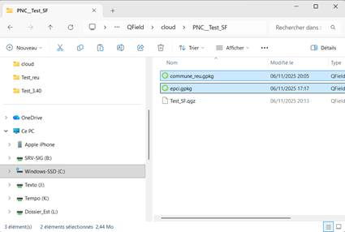

# Créer et déposer un projet QField sur le serveur QFieldCloud

1. Ouvrir un projet QGis vierge

2. Ouvrir la liste des projets QFields du serveur

3. Créer un nouveau projet

4. Donner un nom au projet sans préciser d'emplacement.

5. QGis propose un emplacement par défaut dans le profil utilisateur

6. Enregistrer le projet QGIS dans le dossier du projet QField qu'on vient de créer

7. Copier les données sources (gpkg files) dans le même dossier

8. Ajouter les données sources au projet QGIS

9. Ouvrir la liste des projets QFields du serveur

10. Sélectionner le projet QField qu'on vient de créer

11. Lancer la synchronisation
12. Téléverser les fichiers ou modifications

**Le projet est disponible sur le serveur**

# Le partage de fond de cartes entre projet QField

Le principe est d'avoir un fond de carte unique sur le smartphone qui puisse être exploité par plusieurs projets QField.

Pour cela, lors de la préparation du projet dans QGIS, il faut indiqué dans les Préférences / options, onglet « Source de données » un « chemin de données localisé devant correspondre » à l'emplacement du fond de carte sur le pc.

Exemple avec un fond de carte stocké localement sur le PC :

Il faut ensuite déposer une première fois le fichier du fond de carte sur le smartphone, dans le dossier « Android/data/ch.opengis.qfield/files/QField/basemaps » qui se trouve dans le stockage interne.

Vu que le fond de carte ne doit pas être packagé, il faut commencer par créer un projet QField vierge

Ajouter ensuite le fond de carte puis les couches.

Dans le cas d'un ajout de couche de données sous forme de fichier, il faut préalablement les intégrer ou les convertir en geopackage qui devra être stocké à l'intérieur du dossier du projet qfield (définit lors de la création du projet vierge)

Ce sont les fichiers gpkg qui devront être utilisés dans qgis pour créer le projet QField

Pour la publication du projet dans QFieldCloud :

Les formats supportés : jp2, tiff et mbtiles.

Petite subtilité sur le format mbtiles, si le fichier mbtiles n'a pas été généré par QGIS, il se peut qu'il ne soit pas lu par qfield !!!

## Partage des fonds de cartes entre QField, OccTax et OruxMap

Il est possible de déplacer l'emplacement du dossier basemaps de QField sur la carte SD ou sur le stockage interne.

Pour cela, depuis les paramètres du téléphone, aller dans application et rechercher QField. Entrer dedans et appuyer sur « Stockage ». Sur cette interface, il est possible d'appuyer sur « Modifier » choisir « Carte SD ». Patientez jusqu'à la fin de la copie.

Aprsè ça, le dossier basemap se trouve sur la carte SD, dans le dossier Android/data/ch.opengis.qfield/files/QField/basemaps.

Il est ainsi possible de partager le fond de cartes entre QField et OccTax.

Si les fonds Occtax, ont été initialement stockés dans un dossier mapfiles qui est ensuite indiqué dans les fichiers de conf de GN, il est conseillé de conserver ce dossier mapfiles vide. Occtax sera en mesure d'aller chercher les fonds désormais situé dans le dossier basemaps de Qfiled.

Il est aussi possible et plus propre de refaire les fichiers de config de GN.

Par contre, OruxMap ne semble pas pouvoir accéder au fond de carte contenu dans ce dosier basemap car il n'est pas possible de faire pointer l'option « Options globales / Carte / Dossier cartes » vers ce dossier.

