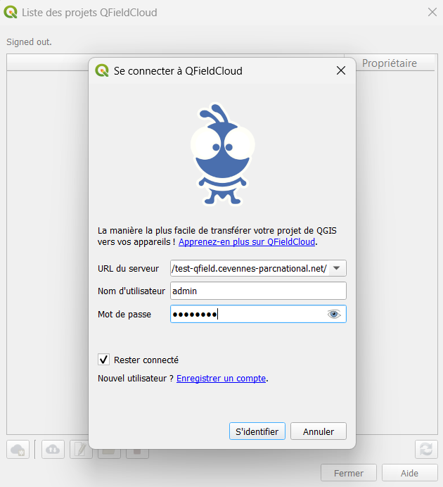
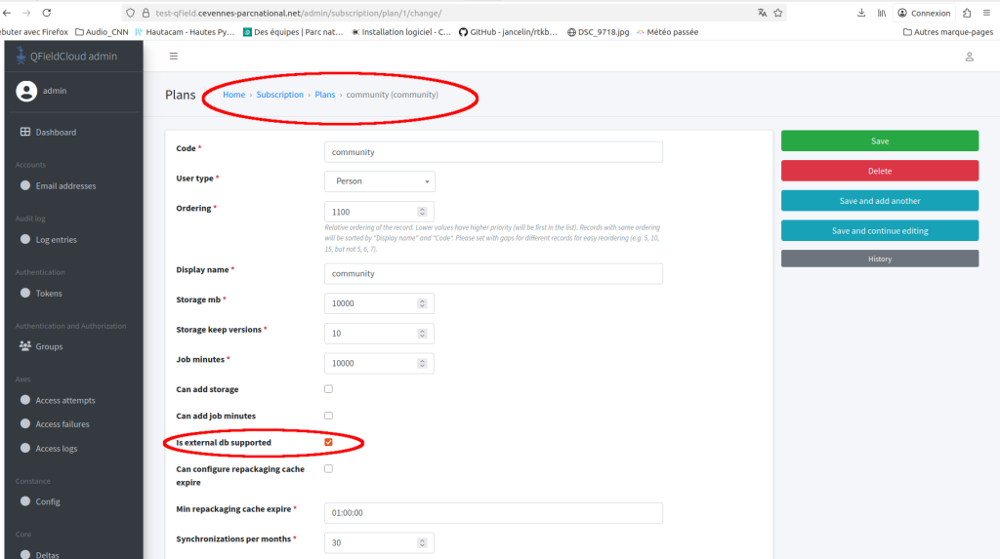
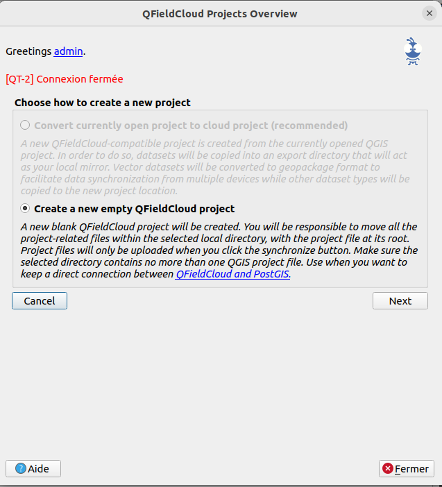
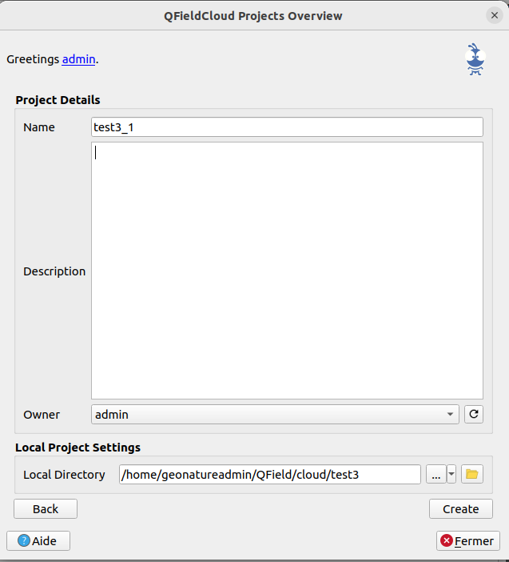
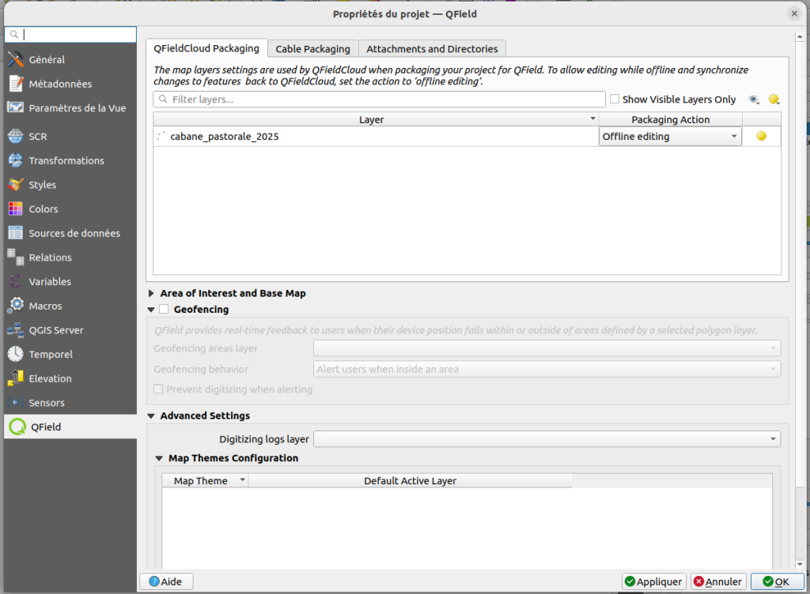
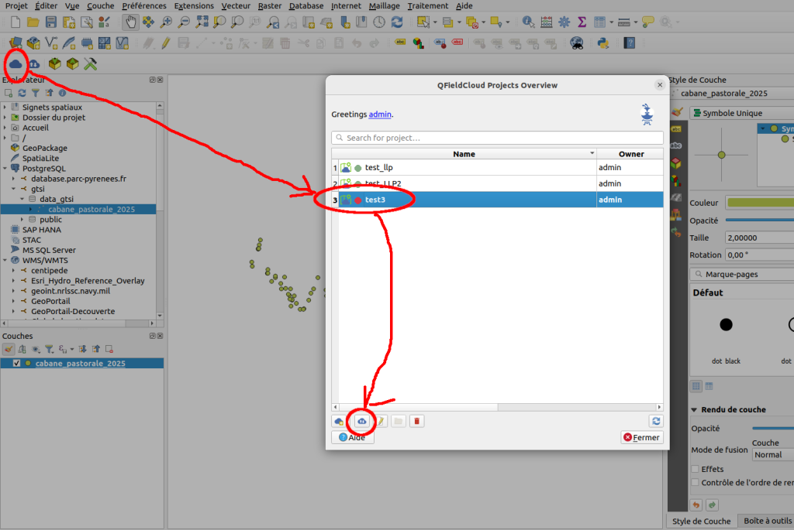

QFIELD Cloud
============

PROJETGIS =\> PROJET QFIELD
===========================

***Les projets proposés au cours du workshop***

Projet consultation :

Nom du projet : projet\_visualisation

-   zonage (ref\_geo) :
    <https://www.data.gouv.fr/datasets/contours-des-11-parcs-nationaux-de-france/#/resources/bb4cda9a-9036-4458-9113-e05b923f0656>

```{=html}
<!-- -->
```
-   Aménagements :

    -   localisation signalétique (Connexion BDD Geotrek PNFor)

```{=html}
<!-- -->
```
-   -   passerelle (Connexion BDD Geotrek PNFor)

-   Risques naturels

    -   vigie crue (API) :
        <https://www.vigicrues.gouv.fr/services/InfoVigiCru.geojson>

    -   Lien doc Flux VigiEau :
        <https://resana.numerique.gouv.fr/public/information/consulterAccessUrl?cle_url=1815913141D2MCZAQMVT5VaVNjB2sDJwBsU2EPLgY/CmUHYlc/ADgPOwM0UDJYbQFhB2gFNw>==

        -   Commande python :
            QgsProject.instance().addMapLayer(QgsVectorLayer
            (\"/vsicurl/https://regleau.s3.gra.perf.cloud.ovh.net/pmtiles/zones\_arretes\_en\_vigueur.pmtiles\",
            \"zones\_restriction\", \"ogr\"))

    -   BRA, pas pertinent sur le parc PNFor =\> Station météo :
        <https://public-api.meteofrance.fr/public/DPClim/v1/liste-stations/infrahoraire-6m?id-departement=52&parametre=precipitation>
        (token valable une heure).

\- données naturalistes (GeoNature)

-   fond de carte hors ligne (mutualisation entre les projets) : mbtiles
    PNFor
-

Projet Saisie dans postgis

\- polygones avec snapping : habitat/zones humides

\- formulaire complexe avec des listes déroulantes (issues de BD)

\- rendu dynamique (style/information qui s'adapte en fonction de la
saisie)

\- trace et jalon : gpslike

-   point avec photo

Connexion au serveur QField cloud depuis QGis

Prérequis : installation de l'extension QFieldSync

{width="0.7602in"
height="0.698in"}{width="2.4138in"
height="2.6366in"}

L'accès à la zone de saisie pour renseigner l'URL se fait par un double
clic sur le logo

{width="3.3327in"
height="3.6665in"}

Connexion avec une base postgis
===============================

<https://github.com/opengisch/QField/discussions/2508>

\
L\'utilisateur admin créé lors de l\'installation est associé au \"Plan
Community\". Il faut activer le paramètre \"is external db supported\"
dans ce plan

{width="6.6929in"
height="3.7453in"}

Créer un projet qfield vierge dans QGIS

{width="4.5839in"
height="5.0398in"}

Après avoir cliqué sur \"Next\", renseigner le champ name (par le nom
que l\'on souhaite donner au projet)

Définir l\'emplacement local du projet

{width="4.0681in"
height="4.4819in"}

Cette étape créé un dossier vide au niveau de l\'emplacement définit
dans \"Local Directory\"

Ensuite, depuis QGIS, créer son projet en ajoutant les couches
souhaitées (dont la couche postgis)

Dans les \"paramètres du projet QField\" attribuer \"Offline editing\"
pour la couche postgis

{width="6.6929in"
height="4.9146in"}

Enregistrer le projet dans le dossier définit dans le local \"Local
Directory\"

Publier le projet dans QField

{width="6.6929in"
height="4.4772in"}

Une fois le projet publiée, la couche du projet QGis n\'est pas
transformée en gpkg, elle reste un lien vers la base de données.

Lors de la récupération du projet sur le terminal mobile si une erreur
apparait Permission denied, plan is insufficient c\'est que votre
utilisateur n\'a pas les permissions d\'accéder à une base externe. Ce
paramètre est géré par le plan auquel souscrit l\'utilisateur. Il faut
le changer de plan ou ajouter la permission is\_external\_db\_supported
au Plan (<https://github.com/opengisch/qfieldcloud/issues/870>)
