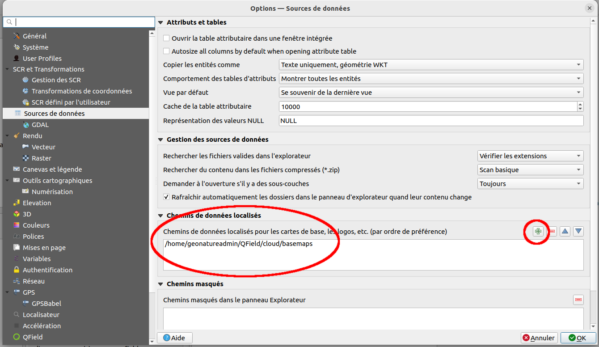
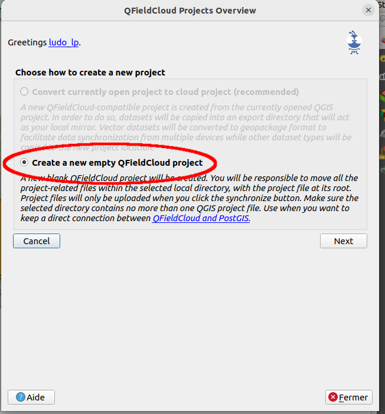
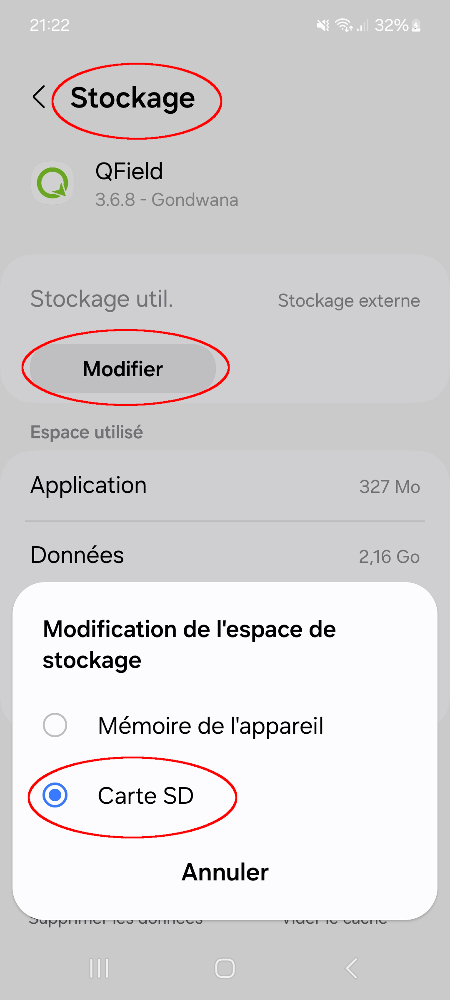
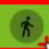
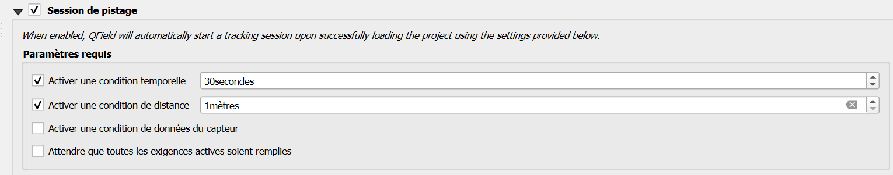
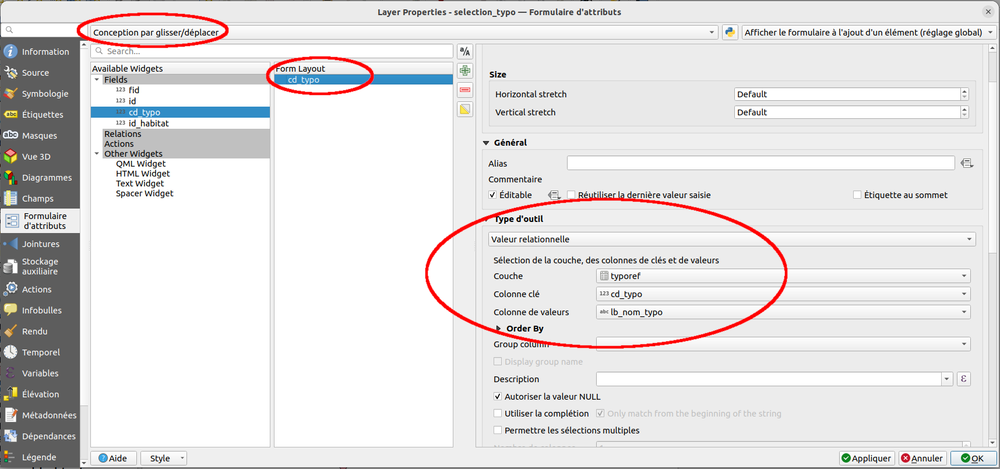
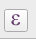
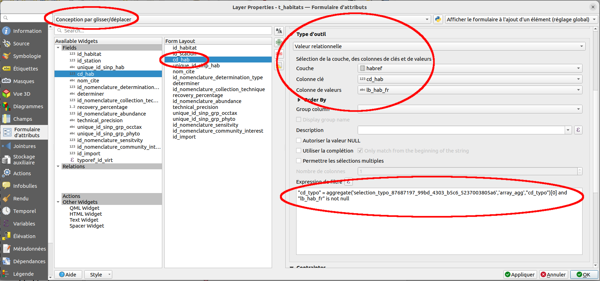

Workshop - GTsi groupe géomaticien 
===================================


QFIELD Cloud
============

PROJETGIS =\> PROJET QFIELD
===========================

***Les projets proposés au cours du workshop***

Projet consultation :

Nom du projet : projet\_visualisation

-   zonage (ref\_geo) :
    <https://www.data.gouv.fr/datasets/contours-des-11-parcs-nationaux-de-france/#/resources/bb4cda9a-9036-4458-9113-e05b923f0656>

```{=html}
<!-- -->
```
-   Aménagements :

    -   localisation signalétique (Connexion BDD Geotrek PNFor)

```{=html}
<!-- -->
```
-   -   passerelle (Connexion BDD Geotrek PNFor)

-   Risques naturels

    -   vigie crue (API) :
        <https://www.vigicrues.gouv.fr/services/InfoVigiCru.geojson>

    -   Lien doc Flux VigiEau :
        <https://resana.numerique.gouv.fr/public/information/consulterAccessUrl?cle_url=1815913141D2MCZAQMVT5VaVNjB2sDJwBsU2EPLgY/CmUHYlc/ADgPOwM0UDJYbQFhB2gFNw>==

        -   Commande python :
            QgsProject.instance().addMapLayer(QgsVectorLayer
            (\"/vsicurl/https://regleau.s3.gra.perf.cloud.ovh.net/pmtiles/zones\_arretes\_en\_vigueur.pmtiles\",
            \"zones\_restriction\", \"ogr\"))

    -   BRA, pas pertinent sur le parc PNFor =\> Station météo :
        <https://public-api.meteofrance.fr/public/DPClim/v1/liste-stations/infrahoraire-6m?id-departement=52&parametre=precipitation>
        (token valable une heure).

\- données naturalistes (GeoNature)

-   fond de carte hors ligne (mutualisation entre les projets) : mbtiles
    PNFor
-

Projet Saisie dans postgis

\- polygones avec snapping : habitat/zones humides

\- formulaire complexe avec des listes déroulantes (issues de BD)

\- rendu dynamique (style/information qui s'adapte en fonction de la
saisie)

\- trace et jalon : gpslike

-   point avec photo

Connexion au serveur QField cloud depuis QGis

Prérequis : installation de l'extension QFieldSync

{width="0.7602in"
height="0.698in"}{width="2.4138in"
height="2.6366in"}

L'accès à la zone de saisie pour renseigner l'URL se fait par un double
clic sur le logo

{width="3.3327in"
height="3.6665in"}

Connexion avec une base postgis
===============================

<https://github.com/opengisch/QField/discussions/2508>

\
L\'utilisateur admin créé lors de l\'installation est associé au \"Plan
Community\". Il faut activer le paramètre \"is external db supported\"
dans ce plan

{width="6.6929in"
height="3.7453in"}

Créer un projet qfield vierge dans QGIS

{width="4.5839in"
height="5.0398in"}

Après avoir cliqué sur \"Next\", renseigner le champ name (par le nom
que l\'on souhaite donner au projet)

Définir l\'emplacement local du projet

{width="4.0681in"
height="4.4819in"}

Cette étape créé un dossier vide au niveau de l\'emplacement définit
dans \"Local Directory\"

Ensuite, depuis QGIS, créer son projet en ajoutant les couches
souhaitées (dont la couche postgis)

Dans les \"paramètres du projet QField\" attribuer \"Offline editing\"
pour la couche postgis

{width="6.6929in"
height="4.9146in"}

Enregistrer le projet dans le dossier définit dans le local \"Local
Directory\"

Publier le projet dans QField

{width="6.6929in"
height="4.4772in"}

Une fois le projet publiée, la couche du projet QGis n\'est pas
transformée en gpkg, elle reste un lien vers la base de données.

Lors de la récupération du projet sur le terminal mobile si une erreur
apparait Permission denied, plan is insufficient c\'est que votre
utilisateur n\'a pas les permissions d\'accéder à une base externe. Ce
paramètre est géré par le plan auquel souscrit l\'utilisateur. Il faut
le changer de plan ou ajouter la permission is\_external\_db\_supported
au Plan (<https://github.com/opengisch/qfieldcloud/issues/870>)

**

La partage de fond de cartes entre projet QField
================================================

Le principe est d'avoir un fond de carte unique sur le smartphone qui
puisse être exploité par plusieurs projet QField.

Pour cela, lors de la préparation du projet dans QGIS, il faut indiqué
dans les Préférences / options, onglet « Source de données » un chemin
de données localisé devant correspondre à l'emplacement du fond de carte
sur le pc.

Exemple avec un fond de carte stocké localement sur le PC :

{width="6.6929in"
height="3.8756in"}

Il faut ensuite déposer une première fois le fichier du fond de carte
sur le smartphone, dans le dossier
« Android/data/ch.opengis.qfield/files/QField/basemaps » qui se trouve
dans le stockage interne.

Vu que le fond de carte ne doit pas être packagé, il faut commencer par
créer un projet QField vierge

{width="6.6929in"
height="7.2063in"}

Ajouter ensuite le fond de carte puis les couches.

Dans le cas d'un ajout de couche sous forme de fichier, il faut
préalablement les intégrer ou les convertir en geopackage qui devra être
stocké à l'intérieur du dossier du projet qfield (définit lors de la
création du projet vierge)

Ce sont les fichier gpkg qui devront être utilisé dans qgis pour créer
le projet QField

Pour la publication du projet dans QFieldCloud :

{width="6.6929in"
height="4.4772in"}

Les formats supportés : jp2, tiff et mbtiles.

Petite subtilité sur le format mbtiles, si le fichier mbtiles n'a pas
été généré par QGIS, il se peut qu'il ne soit pas lu par qfield !!!

Partage des fonds de cartes entre QField, OccTax et OruxMap
-----------------------------------------------------------

Il est possible de déplacer l'emplacement du dossier basemaps de QField
sur la carte SD ou sur le stockage interne.

Pour cela, depuis les paramètres du téléphone, aller dans application et
rechercher QField. Entrer dedans et appuyer sur « Stockage ». Sur cette
interface, il est possible d'appuyer sur « Modifier » choisir « Carte
SD ». Patientez jusqu'à la fin de la copie.

{width="2.7693in"
height="5.9701in"}

Aprsè ça, le dossier basemap se trouve sur la carte SD, dans le dossier
Android/data/ch.opengis.qfield/files/QField/basemaps.

Il est ainsi possible de partager le fond de cartes entre QField et
OccTax.

Si les fonds Occtax, ont été initialement stockés dans un dossier
mapfiles qui est ensuite indiqué dans les fichiers de conf de GN, il est
conseillé de conserver ce dossier mapfiles vide. Occtax sera en mesure
d'aller chercher les fonds désormais situé dans le dossier basemaps de
Qfiled.

Il est aussi possible et plus propre de refaire les fichiers de config
de GN.

Par contre, OruxMap ne semble pas pouvoir accéder au fond de carte
contenu dans ce dosier basemap car il n'est pas possible de faire
pointer l'option « Options globales / Carte / Dossier cartes » vers ce
dossier.

TEST TRACKING
=============

Doc Qfield :
<https://docs.qfield.org/how-to/navigation-and-positioning/tracking/>

Pour enregistrer une trace dans le projet Qfield, une couche ligne /
polyligne doit être créée au préalable et déposer dans le projet.

Le suivi peut se paramètrer de 2 façon :

-   manuelle : depuis qfiled, clique long sur la couche, démarrer le
    suivi et associer les paramètres souhaités. Un symbole
    {width="0.3402in"
    height="0.3402in"} apparaît à côté de la couche. Pour arrêter le
    suivi, il faut alors appuyer sur ce petit bonhomme et arrêter le
    suivi. Il est aussi possible de reprendre le suivi.
-   Automatique : le paramètre se fait dans QGIS depuis la propriété de
    la couche. Il faut ensuite renseigner les paramètres

{width="6.6929in"
height="1.3165in"}

Cette fonctionnalité peut servir à saisir des geom depuis un suivi de
géolocliasation.

Il est aussi possible de connecter sa localisation qfield à un RTK.

TEST mise à jour automatique
----------------------------

Depuis Qfield, et pour cahque projet, il est possible de paramétrer
l'envoi automatique des modifications toutes les 30 minutes.

Test réalisé : création de 2 couches en dur déposé dans le projet. Modif
des 2 couches avec 2 utilisateurs différents =\> pas convainquant. A ne
pas privilégier

QField -- Formulaire -- Filtrer un champ select sur la base d'un choix sur une autre table
==========================================================================================

Situation :
-----------

On a une couche « t\_habitat » qui possède un champ pointant vers une
table « habref » qui elle est lié à une table « typoref ».

L'idée est de pouvoir filtrer dans le formulaire habitat le select de
l'habitat en fonction d'une typologie d'habitat.

Déclaration des jointures dans QGis
-----------------------------------

Il faut créer une table intermédiaire, ici nommmé « select\_typo »
composé d'un champ id et d'un champ cd\_typo.

Dans les **propriétés **du **projet** qgis, aller dans l'onglet « Source
de données » et déclarer le relation entre les table :

-   t\_habitat (cd\_hab) -- habref (cd\_hab)
-   habref (cd\_typo) -- typoref (cd\_typo)
-   select\_typo (cd\_typo) -- typoref (cd\_typo)

Paramétrage du formulaire
-------------------------

### Table « select\_typo »

Ouvrir les propriétés de la couche « select\_typo » aller dans l'onglet
« Formulaire ».

-   Dans la barre du haut, choisir « Conception par glisser/déplacé »

-   dans « Form Layout » ne conserver que « cd\_typo »

-   Dans les types d'outil associés au champ

    -   Choisir Valeur relationnelle
    -   couche = typoref
    -   colonne clé = cd\_typo
    -   colonne de valeur = lb\_nom\_typo

{width="6.6929in"
height="3.1398in"}

Validez la configuration du formulaire en cliquant sur « OK »

### Table habitat

Sur le même principe, aller dans le paramétrage du formulaire dans les
propriétés de la couche « t\_habitat »

-   sélectionner « Conception par glisser/déplacé »

-   Cliquer sur le champ « cd\_hab »

-   Choisir le type d'outil « Valeur relationnelle »

    -   couche = habref

    -   colonne clé = « cd\_hab »

    -   Colonne de valeurs = « lb\_hab\_fr »

    -   Ajouter une expression de filtre :

        -   \"cd\_typo\" =
            aggregate(\'selection\_typo\_87687197\_99bd\_4303\_b5c6\_5237003805a6\',\'array\_agg\',\"cd\_typo\")\[0\]
            and \"lb\_hab\_fr\" is not null

            -   attention, le nom de la couche
                « selection\_typo\_87687197\_99bd\_4303\_b5c6\_5237003805a6 »
                est différent d'un projet à l'autre. Pour récupérer le
                bon nom, cliquer sur l'éditeur de
                formule{width="0.2618in"
                height="0.1953in"}, effacer cette valeur de la formule,
                dérouler « couche » et double cliquer sur
                « select\_typo »

{width="6.6929in"
height="3.1398in"}

### Initialisation des données

Ajouter une entité dans la table « select\_typo » avec l'identifiant
« 1 » laisser cd\_typo null ou avec n'importe quelle valeur si vous
voulez définir une typologie d'habitat par défaut.

La table « t\_habitat » doit obligatoirement avoir une valeur. Cette
contrainte est du au fait que la table n'est pas géométrique et que dans
ce cas, il n'est pas possible d'ajouter une données dans une table vide
avec QField\...

### Qfield - Principe de foncitonnement

Après avoir poussé le projet et l'avoir récupéré sur smartphone il
faut :

-   définir la typologie que l'on souhaite utiliser

    -   Pour cela, appuyer sur les trois barres horizontales en haut à
        gauche pour lister les couches
    -   Faire un appuis long sur la couche select\_typo puis « Afficher
        la liste des entités »
    -   Appuyer sur l'élément «1 »
    -   Activer l'édition
    -   Choisissez la typologie
    -   Valider la modification

-   Editer un habitat

    -   Depuis la liste des couches, faire un appuis long sur la couche
        « t\_habitat » puis « Afficher la liste des entités »
    -   Appuyer sur l'habitat
    -   Activer l'édition,
    -   choisissez l'habitat pour le champ cd\_hab (attention,
        l'affichage de la liste peut être un peu long)
    -   Valider les modifications

Concrètement, le formulaire de « t\_habitat » devrait être inclut dans
le formulaire de la station (t\_station) ce qui le rendrait accessible
dès la numérisation d'uin polygone.
