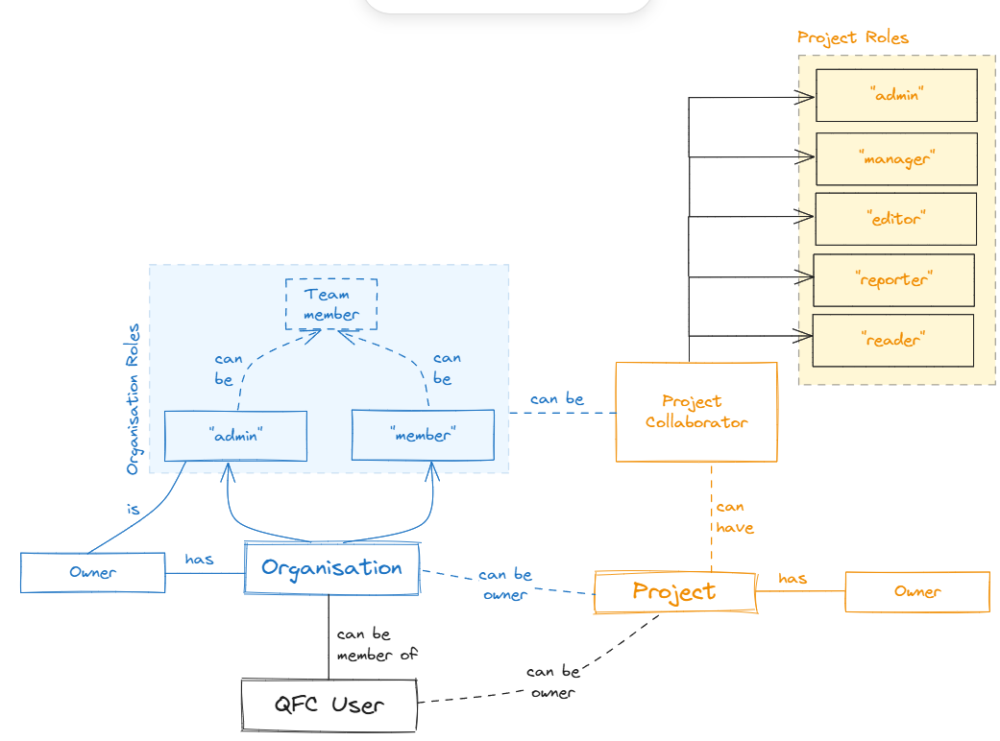

## Gestion des droits
[Concepts basiques Qfield](https://docs.qfield.org/reference/qfieldcloud/concepts/).

Il faut distinguer les droits associés à la gestion du QGisCloud et les droits associés aux utilisateurs d'un projet.
Tout utilisateur est déclaré dans "Core / People".

### Côté QGisCloud

Un utilisateur peut être associé à un groupe ("Authentication and Authorization / Group"). Le groupe correspondant à un ensemble d'autorisation relatif à la gestion du QGisCloud. 
Par défaut, il n'y en a pas et l'utilisateur admin est déclaré comme superuser.
Dans le cadre des Parcs nationaux, il faudra évaluer la nécessité et créer un groupe pour les administrateurs de chaque parc où de déclarer chaque admin comme superuser.
Globalement, chaque objet QFieldCloud offre les droits suivants :
* can add
* can change
* can delete
* can view

### Côté projet

Il est possible de définir une organisation ("core / Organization") qui dans le cadre des Parcs nationaux pourrait correspondre à chaque parc (PNPC, PNFor, PNP...)

A l'intérieur de ces organisations, il est possible de définir une ou plusieurs équipes ("core / Team") qui sont eux même peuplés par une liste d'utilisateur.
C'est ensuite au niveau du projet ("core / project") qu'il est possible d'y associer une ou plusieurs équipes.

Toutefois, il est possible de rattacher directement des utilisateurs aux projets.
Pour chaque utilisateur ou equipe rattaché à un projet, il est possible de lui définir son niveau d’autorisation :
* admin : Peut renommer et supprimer le projet. Possède les même droits que le propriétaire du projet
* manager : Peut ajouter ou supprimer des collaborateurs
* editor : Peut éditer des connées
* reporter : Peut seulement ajouter des donnée, pas le droits de modificaiton ou de suppression
* reader : Lecture seule

L’utilisateur ne peut voir que les projets rattachés à son équipe (ou à lui directement) ainsi que les projets déclarés comme public. Dans ce second cas, depuis QFielf mobile, il apparaitra dans l’onglet « Communauté » mais il ne pourra pas faire de modification.

Sources :
<https://docs.qfield.org/reference/qfieldcloud/concepts/#gallery>

### Le concept d\'email

Lors de la création d\'un utilisateur, si un email lui est renseigné, l\'utilisateur a alors la possibilité de se connecter avec son identifiant ou avec son adresse email.

QFieldCloud permet, depuis \"Accounts / Email addresses\" de définir plusieurs adresses emails pour un même utilisateur. Ainsi, il est possible de s\'authentifier comme étant l\'utilisateur X à partir de plusieurs adresses et avec un même mot de passe.

L\'intérêt de cette possibilité reste en suspend dans le contexte Parcs nationaux.

###

### Concept des plans et subscriptions

Pour la solution QFieldCloud --- y compris quand elle est
**autohébergée** (self-hosted) --- il est utile de bien distinguer les
notions de **« plan »** et **« subscription / abonnement »**, car elles
répondent à des rôles différents. Voici un résumé clair avec leurs
intérêts et implications.

### 🎯 Qu'est-ce qu'un « plan »

Un *plan* (forfait) définit **le niveau d'offre** : les fonctionnalités,
les limites (stockage, utilisateurs, collaboration privée, etc.), le
type d'usage permis.\
Par exemple, pour QFieldCloud hébergé par le fournisseur cloud :

-   Le plan *Community* gratuit : projets publics / privés illimités,
    mais stockage limité, pas de support avancé, pas d'édition hors
    ligne de couches PostGIS.
    [qfield.cloud+2qfield.cloud+2](https://qfield.cloud/faq.html?utm_source=chatgpt.com)
-   Le plan *Pro* (payant) : fonctionnalités supplémentaires (ex.
    édition hors ligne PostGIS) [qfield.cloud+2QField
    community+2](https://qfield.cloud/pricing?utm_source=chatgpt.com)
-   Le plan *Organization* : pour équipes, gestion des membres,
    collaboration, tarification par utilisateur actif.
    [QField+1](https://docs.qfield.org/get-started/storage-qfc/?utm_source=chatgpt.com)
-   Dans le contexte autohébergé, bien que vous gériez votre propre
    infrastructure, la notion de plan reste pertinente si vous appliquez
    une structure de tarification ou de niveaux internes, ou si vous
    utilisez la version «hébergée» comme référence.

**Intérêt du plan**

-   Il permet de clarifier ce que l'on peut faire ou non (ex. nombre
    d'utilisateurs, collaboration privée, accès en hors-ligne PostGIS).
-   Il sert à dimensionner l'infrastructure ou l'abonnement/licence
    correspondante.
-   Il rend la proposition de valeur visible (ce que j'obtiens si je
    choisis ce niveau).
-   Il permet de faire évoluer l'usage (ex. passer du plan «Community»
    au plan «Pro»).

### 🔁 Qu'est-ce qu'une « subscription / abonnement »

Une *subscription* est le mécanisme par lequel on **active** un plan
payant et on paie pour l'usage de ce plan selon une périodicité
(mensuelle, annuelle, etc.).
[qfield.cloud+1](https://qfield.cloud/tos.html?utm_source=chatgpt.com)\
Même dans un contexte autohébergé, la notion peut exister : par exemple,
vous hébergez QFieldCloud vous-même mais pouvez souscrire à un support
professionnel ou à des fonctionnalités additionnelles liées au logiciel
ou au service.

**Intérêt de l'abonnement**

-   Il fixe l'engagement financier et périodique pour bénéficier du
    plan.
-   Il permet de suivre la facturation, la durée, la résiliation.
-   Il donne accès aux mises à jour, au support, à certaines options
    (exemple : stockage supplémentaire, utilisateurs actifs).
    [QField+1](https://docs.qfield.org/get-started/storage-qfc/?utm_source=chatgpt.com)
-   Il facilite la gestion administrative (facturation, licences) pour
    l'organisation.

### 🧐 Particularités pour l'autohébergement

Quand vous autohébergez QFieldCloud, voici quelques nuances importantes
:

-   Vous contrôlez toute l'infrastructure (serveur, base de données,
    stockage, réseau) : voir guide d'installation.
    [Geotribu+1](https://geotribu.fr/articles/2024/2024-02-06_mise_en_place_serveur_qfieldcloud/?utm_source=chatgpt.com)
-   Bien que la version autohébergée soit libre (open-source) et sans
    payer directement le service hébergé, certains modules liés aux
    plans ou abonnements peuvent toujours apparaître (gestion des
    utilisateurs, "active user", fonctionnalités payantes). Par exemple,
    un article mentionne qu'il faut parfois manipuler la table
    *subscription\_subscription* pour remettre le statut «active\_paid»
    dans une instance self-hosted.
    [Geotribu](https://geotribu.fr/articles/2024/2024-02-06_mise_en_place_serveur_qfieldcloud/?utm_source=chatgpt.com)
-   Si vous utilisez l'infrastructure officielle hébergée (cloud) alors
    la tarification «plan» / «subscription» est clairement définie. Pour
    l'autohébergement, vous devez internaliser : plan interne + coût de
    maintien + licences éventuelles + support.

### ✅ En résumé

-   **Plan** = quel niveau d'usage/fonctionnalités vous choisissez.
-   **Subscription** = la façon de payer périodiquement pour ce plan.
-   Dans l'autohébergement, le plan est un choix de niveau (même s'il
    n'est pas facturé par un fournisseur externe), l'abonnement peut
    être interne (ex. support/licence) ou rendre compte d'un fournisseur
    tiers (si vous achetez un service complémentaire).
-   Bien vérifier : utilisateurs actifs, stockage, édition hors‐ligne,
    PostGIS, etc. (voir FAQ)

###

### Gestion des quotas

Des quotas peuvent être définis soit globalement (à travers les
\"Subscription / Plans\" et \"Subscription / Subscription\") ou
localement à un projet.

#### Les quotas globaux

Un plan peut être assimilé à un forfait auquel il faut que les
utilisateurs doivent souscrire

Par défaut, deux \"plans\" sont définis dans QFieldCloud :

-   Community : c'est le plan par défaut aui est attribué aux
    utilisateur lors de leur création
-   Organization : c'est celui par défaut qui est attribué lors de la
    création d'une organisation

Au regard de la valeur du champ « Ordering », il semblerais que ce soit
le forfait « community » qui s'applique même si l'utilisateur est
associé à une organisation. Se pose la question de quand le forfait
« Organisation » prend le dessus ?

Dans un contexte PNx, il n'y aurait pas besoin de créer d'autre type de
forfait. Ainsi, les resssources et l'espace disque serait partagé entre
tous. Les quota de ressources attribué à chaque forfait seraient à
ajuster en fonction des capacité du serveur hôte.

Il pourrait être envisagé qu'un (ou deux) administrateurs dans les PNx
soient désignés pour gérer le serveur. Seul eux aurait des accès pour
éditer les forfaits (à travers un groupe dédié) car au plus proche
suivre le niveau d'usage du serveur.

Fonctionnement à connaître :

-   Lors de la création d'un utilisateur, ce dernier est souscrit
    automatiquement au forfait « community »
-   Lors de la création d'une organisation, cette dernière souscrit
    automatiquement au forfait « Organization »

Si un utilateur est propriétaire d'un projet, alors il prend les
réglages associé au forfait community auquel il est rattaché par défaut.
Cependant, si un utilisateur fait partie d'une organisation et qu'il est
déclaré « organization member admin » de celle-ci alors il peut créer un
projet en mettant son organisation en tant que propriétaire du projet :
dans ce cas c'est les réglages du forfait Organization qui sont utilisé.

IMPORTANT : Afin de permettre la saisie direct dans des bases postgreSQL
/ Postgis il faut penser à cocher l'option « Is external db supported »
dans le Plan « Community »
