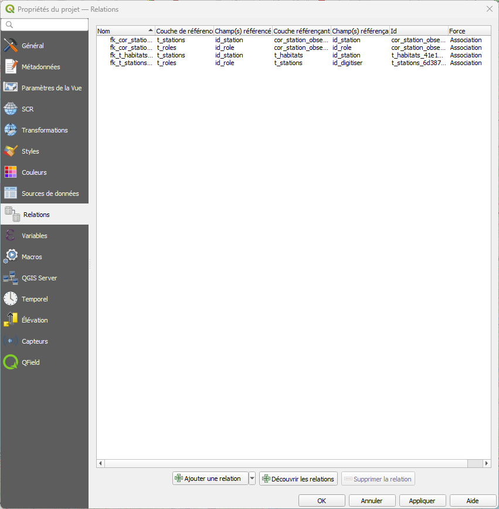
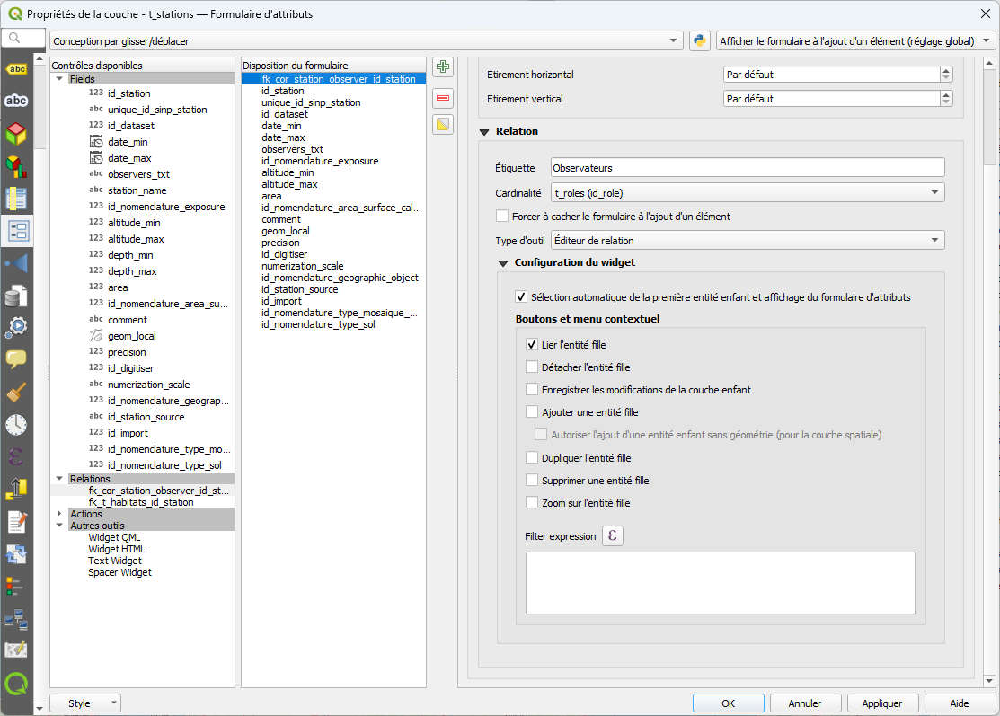

# Saisie de données dans PostgreSQL depuis QField Cloud

Il est possible de saisir, depuis QField, des données directement dans une base de données relationnelle PostgreSQL.

> Tests non aboutis, des problèmes persistaient notamment pour l'insertion de champs par défauts gérés par la BDD (clé primaire séquence d'entiers) [cf section 1. Préparer les tables PostgreSQL](#1-préparer-les-tables-postgresql). 

## Prérequis

- Une base de données PostgreSQL avec PostGIS
- QGIS Desktop avec accès à la base de données
- Un compte QField Cloud
- L'extension QGIS "QFieldSync"
- Sur QFieldCloud avec l'utilisateur admin créé lors de l'installation est associé au \"Plan Community\". Il faut activer le paramètre \"is external db supported\"
dans ce plan


## Configuration de la base de données

### 1. Préparer les tables PostgreSQL

Assurez-vous que vos tables PostgreSQL sont correctement configurées.

> Remarque importante : Attention QField utilise un système d'uuid pour gérer les modifications concurrentes. Il n'est donc pas possible d'utiliser directement des tables avec des clés primaires ajoutés automatiquement via une séquence.
>
> **Solution recommandée** : Passer par une base de données tampon gérée avec des UUID pour la saisie terrain, puis synchroniser vers votre base de production avec des clés primaires séquentielles.
>
> Exemple de table compatible QField :
> ```sql
> CREATE TABLE observations_terrain (
>     id UUID PRIMARY KEY DEFAULT gen_random_uuid(),
>     nom VARCHAR(255),
>     geom GEOMETRY(Point, 2154)
> );
> ```

### 2. Droits d'accès

L'utilisateur PostgreSQL doit avoir les droits nécessaires.

## Configuration du projet QFieldCloud dans QGIS

[Issue QFieldCloud liée à la configuration de la BDD Postgis](https://github.com/opengisch/QField/discussions/2508)

### 1. Création du projet

Créer un nouveau projet QFieldCloud vide depuis l'interface QFieldSync


Définir l'emplacement du projet sur l'ordinateur


> Attention pour l'utilisation directement avec une base de données, il est important de créer un nouveau projet vide et ensuite d'ajouter les couches dans ce projet. Cela est dû au fait que lorsqu'on utilise un projet existant, lors de la synchronisation, QFieldSync créé un fichier .gpkg avec toutes les couches, tandis que lors de la création d'un projet vide, QFieldSync transmets les informations de chaque couche indépedemment.

### 2. Connexion à la base de données

1. Dans QGIS, ouvrir le **Gestionnaire de sources de données** > **PostgreSQL**
2. Créer une nouvelle connexion vers votre base de données
3. Tester la connexion et sauvegarder

#### 2.1 Utilisation des PG_SERVICE
##### Préparation du .pg_service.conf
Sur le pc, localement, créer un fichier .pg_service.conf qui sera enregistré dans le home de l’utilisateur (ou %APPDATA%\postgresql\pg_service.conf pour windows – non testé!).

Écrire les informations suivantes dans le fichier .pg_services :
[nom_service]
host=
port=
dbname=
user=
password=

En renseignant les bonnes valeurs pour chaque variable et en remplaçant « nom_service » par le nom que l’on veut donner à notre service.

(il est possible de déclarer plusieurs service dans le même fichiers – pas testé

Dans Qgis, aller dans le menu « couche » puis « Gestionnaire de source de données ».
Aller dans l’onglet « PostgreSQL » puis sur « Nouveau ». 
Ne renseigner que le champ « Service » par le nom attribué au service et cliquer sur « Tester la connexion » pour s’assurer qu’il n’y a pas de problème de connexion.

##### Préparation du projet Qgis pour Qfield
Construire le projet qgis de la même façon que pour l’utilisation de couche postgreSQL dans un projet Qfield (Création d’un projet Qfield vierge → ajout des couches → Sauvegarde du projet dans le dossier du projet Qfield → Synchronisation)
           
##### Configuration côté QfieldCloud
Dans QfieldCloud, Aller dans le menu « Project » puis cliquer sur le projet que vous venez de créer.
Cliquer sur l’onglet « Secrets » puis sur « add Secrets ».
Donner un nom au Secret (stratégie de nommage à définir).
Choisir « pg_service » dans le « Type »
Saisir l’ensemble des services utilisés par le projet (selon la même syntaxe que que le fichier .pg_services créé localement sur son pc).
Cliquer sur « save » pour l’enregistrer

##### Synchronisation sur Qfield mobile
Synchronisez votre projet sur smartphone de façon habituel

### 3. Charger les couches

1. Ajouter la ou les tables PostgreSQL comme couches dans QGIS
2. Vérifier que les couches sont éditables (propriétés de la couche)
3. Dans les \"paramètres du projet QField\" attribuer \"Offline editing\"
pour la couche postgis

{width="6.6929in"
height="4.9146in"}

### 4. Configuration des formulaires

Configurer les formulaires de saisie pour optimiser l'expérience mobile :

1. **Propriétés de la couche** > **Formulaire d'attributs**
2. Configurer les widgets appropriés
3. Définir les champs obligatoires
4. Masquer les champs non nécessaires sur le terrain (ex: `id`, `date_creation`)

### 5. Relations entre tables

Pour gérer des données relationnelles :

1. **Projet** > **Propriétés** > **Relations**
2. Créer les relations entre tables (1:N, N:M) (ou cliquer sur **"+ Découvrir les relations"** pour demander à QGIS de détecter les relations au seins des couches)




3. Dans les formulaires, utiliser les widgets **Relation** pour ajouter automatiquement une ou plusieurs entrées dans la table liée



> [Documentation relations QGIS](https://docs.qgis.org/3.40/fr/docs/user_manual/working_with_vector/joins_relations.html)

### 6. Configuration des sources de données du projet

La configuration des sources de données dans les propriétés du projet QGIS est **cruciale** pour assurer le bon fonctionnement de la saisie sur QField, particulièrement avec des bases PostgreSQL.

#### Accéder aux propriétés du projet

1. Menu **Projet** > **Propriétés** > Onglet **Sources de données**


#### Paramètres importants pour QField

##### 1. Évaluer les valeurs par défaut depuis le fournisseur de données

**☑ Cocher cette option**

Cette option est **essentielle** pour QField avec PostgreSQL. Elle permet de :
- Récupérer les valeurs par défaut définies **directement dans PostgreSQL** (ex: la clé primaire définie par une séquence)
- Garantir que les valeurs calculées côté base de données sont utilisées
- Assurer la cohérence avec les contraintes et règles PostgreSQL

> Attention on ne connaît pas encore bien l'implication de ce paramètre lors de la synchronisation avec QField. Testé uniquement avec des séquences d'entiers, pas avec des uuid comme recommandé par QField.


##### 2. Mode de transaction

**☑ Utiliser le mode Groupe de transaction mise en mémoire tampon**

Active l'utilisation des transactions PostgreSQL pour garantir l'intégrité des données :
- Les modifications sont groupées dans une transaction
- En cas d'erreur, toute la transaction est annulée (rollback)
- Évite les états incohérents dans la base de données
- Particulièrement important lors de modifications sur plusieurs tables liées (évite le problème de clés étrangères non existantes)

**Types de transactions autres** :
- **Groupe de transaction automatique** : Chaque modification est immédiatement envoyée
- **Mise en mémoire tampon** : Les modifications sont retenues jusqu'à l'enregistrement mais ne sont pas groupés dans une seule transaction (valeur par défaut)

> [Lien documentation QGIS sur les sources de données](https://docs.qgis.org/3.40/fr/docs/user_manual/introduction/qgis_configuration.html#data-sources-properties)

## Synchronisation avec QField Cloud

### 1. Synchroniser le projet vers QFieldCloud

Dans **QFieldSync**, cliquer sur **Synchronize Current Cloud Project**

Une fois le projet publiée, la couche du projet QGis n\'est pas
transformée en gpkg, elle reste un lien vers la base de données.

Lors de la récupération du projet sur le terminal mobile si une erreur
apparait Permission denied, plan is insufficient c\'est que votre
utilisateur n\'a pas les permissions d\'accéder à une base externe. Ce
paramètre est géré par le plan auquel souscrit l\'utilisateur. Il faut
le changer de plan ou ajouter la permission is\_external\_db\_supported
au Plan (<https://github.com/opengisch/qfieldcloud/issues/870>)


### 2. Configuration de la connexion PostgreSQL sur le serveur

Pour que QField Cloud puisse accéder à votre base PostgreSQL : Base PostgreSQL accessible depuis le web (configuration -user -password partagée depuis QGIS)

>**Important** : Pour une édition en ligne directe, la base PostgreSQL doit être accessible depuis internet.

## Utilisation sur le terrain

### 1. Télécharger le projet dans QField

1. Ouvrir l'application **QField** sur mobile
2. Se connecter à **QField Cloud**
3. Télécharger le projet
4. Les données sont maintenant accessibles

### 2. Saisir des données

1. Activer le mode édition (crayon)
2. Sélectionner la couche d'édition
3. Cliquer sur le bouton **+** pour ajouter une entité
4. Positionner le point/ligne/polygone sur la carte
5. Remplir le formulaire
6. Enregistrer

### 3. Synchronisation

1. Les données sont modifiées localement dans QField
2. Cliquer sur **Synchroniser** quand une connexion est disponible
3. Les modifications sont envoyées à QFieldCloud
4. QFieldCloud pousse les changements vers PostgreSQL
5. On peut récupérer le projet avec les modifications dans QGIS Desktop via QFieldSync


## Ressources

- [Documentation QField](https://docs.qfield.org/)
- [Documentation QFieldSync](https://github.com/opengisch/qfieldsync)
- [QField Cloud](https://qfield.cloud/)
- [Documentation PostGIS](https://postgis.net/documentation/)

